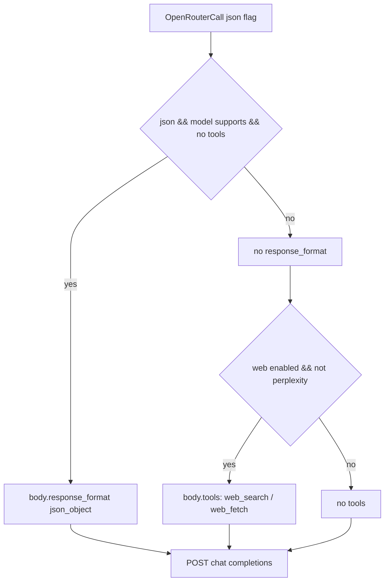
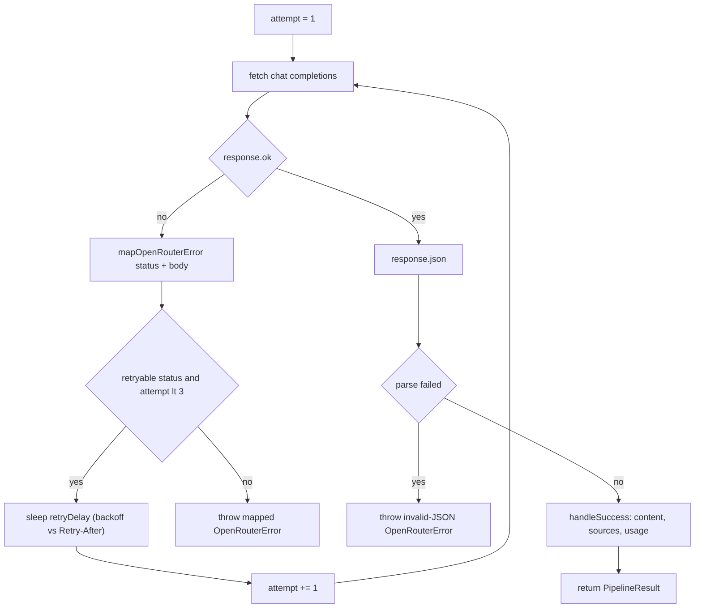

# OpenRouter client (requests, retries, sources, usage)

Every model call the pipeline makes goes through `callOpenRouter` in `src/openrouter.ts`,
which wraps the OpenRouter `/api/v1/chat/completions` endpoint, and every call's token and
cost accounting flows through the pure helpers in `src/cost.ts`. The client is the only
provider adapter: the web retriever (`--web-provider`) and all mode pipelines (from
`src/modes.ts`, via `runMode(config, options, (call) => callOpenRouter(config.openrouter, call))`
in `src/cli.ts`) share this single wrapper, so retry behavior, error mapping, source
parsing, and usage bookkeeping are uniform across every call.

## Layout

| Module | Responsibility |
|---|---|
| `src/openrouter.ts` | Request body and tool construction (`buildTools`), HTTP call with retry (`callOpenRouter`), status→error mapping, source extraction (`extractSources`), response normalization to `PipelineResult` |
| `src/cost.ts` | Pure usage aggregation: `emptyUsage`, `addUsageCall`, `mergeUsage`, `formatCost` |
| `src/types.ts` | Wire shapes: `OpenRouterRequest`, `OpenRouterResponse`, `OpenRouterUsage`, `OpenRouterTool`, plus `UsageCall` / `UsageSummary` / `ServerToolUse` / `Source` |

## The request: body, headers, and server tools

`callOpenRouter` builds the body from the `OpenRouterCall` each mode constructs:

- **Always present:** `model` and `messages` (with `role` limited to `system` / `user` / `assistant`).
- **Optional:** `temperature`, `max_tokens`, `tools`, and `response_format` when the call asks for strict JSON output.
- **Headers:** `Authorization: Bearer <apiKey>` (the key comes from `OPENROUTER_API_KEY` env or the config file; a missing key throws `OpenRouterError` before any network I/O), `Content-Type: application/json`, plus OpenRouter identity headers `HTTP-Referer` (`config.siteUrl` ?? the repo URL) and `X-Title` (`config.appName`).

Server tools are built by `buildTools(model, web)`:

- Returns `undefined` when web is disabled (both search and fetch off), when the model is a Perplexity Sonar model (`perplexity/`), or when nothing is enabled.
- `openrouter:web_search` maps `maxResults` → `max_results`, `maxTotalResults` → `max_total_results`, `blockedDomains` → **`excluded_domains`**, `allowedDomains` → `allowed_domains`, and the engine only when it is not `"auto"`.
- `openrouter:web_fetch` maps `maxContentTokens` → `max_content_tokens`, `blockedDomains` → **`blocked_domains`** (note the different key name versus the search tool), `allowedDomains` → `allowed_domains`, and the engine only when not `"auto"`.

These are **server tools**: OpenRouter runs zero or more searches/fetches on its side inside the single HTTP round trip and returns the final assistant message — there is no client-side tool loop.

### The json_object + tools hard rule

`response_format { type: "json_object" }` is sent **only** when `call.json === true`, the
model supports it (everything except `perplexity/`, via `supportsJsonObjectResponseFormat`),
**and** no server tools were attached:

```ts
if (call.json === true && supportsJsonObjectResponseFormat(call.model) && !tools) {
  body.response_format = { type: "json_object" };
}
if (tools) body.tools = tools;
```

The two conditions are deliberately never combined: observed real responses on Grok +
`web_search` under `json_object` collapse to garbage JSON such as `-1.5e-05` after heavy
search context is injected. When both are needed, the pipeline (`src/modes.ts`) runs a
**two-pass** pattern — first a tools-enabled research call, then a second no-tools call that
formats the retrieved content into JSON (`buildJsonFromResearchMessages` for `--json` + web,
`buildSchemaFromResearchMessages` for `--schema` + web), and merges the two usage summaries
with `mergeUsage`. Perplexity models never receive `response_format` either, because the
same check treats `perplexity/` as unsupported.



Caption: the `response_format` and `tools` gate in `callOpenRouter`; the two are mutually exclusive in a single request.

## The call: retries, backoff, and Retry-After

`callOpenRouter` makes up to **3 attempts** against
`https://openrouter.ai/api/v1/chat/completions`:

- **Retryable conditions:** HTTP `429` or any `>= 500` status, and network-level failures surfacing as `TypeError` whose message contains `fetch` (e.g. `fetch failed`). A retryable condition on the final attempt, or any non-retryable error, is thrown immediately as the mapped `OpenRouterError`.
- **Backoff:** `2^attempt * 1000ms` base (2s, 4s) via `retryDelay`. When the failed response carries a `Retry-After` header (typical for 429s), its value in seconds wins if it is larger than the computed backoff: `Math.max(backoff, seconds * 1000)`. The header is read through optional chaining so mocked responses without `headers.get` do not crash.
- **Non-retryable responses never retry** — 401/403, 402, and 404 tool/model errors fail fast.
- **Invalid JSON** from a 200 response is not retried; it throws `OpenRouterError("OpenRouter returned an invalid JSON response. Please retry.", undefined, { cause })`, keeping the original parse error as the cause.
- Retrying a non-idempotent POST is deliberately accepted: chat completions have no side effects, so replay is safe.

The retry loop wraps the whole attempt (including response parsing), so a transient error
after 3 tries surfaces as `lastError`; if one never materializes the loop falls through to a
generic error.



Caption: `callOpenRouter` retry flow — 3 attempts, retry on 429/5xx/fetch TypeError, fail fast on everything else.

## Status-to-error mapping

`mapOpenRouterError(status, text, model, toolsRequested)` classifies failures in strict order, each producing an `OpenRouterError` that carries the HTTP status plus a human-readable message with the provider body preserved:

1. **401 / 403** → `OpenRouter authentication failed: <detail>` — bad or missing key.
2. **402** → `OpenRouter credits or quota error: <detail>` — insufficient balance/credit limit.
3. **404 or body containing "tool use" while tools were requested** → `Model does not support OpenRouter server tools: <model>. Use a Grok 4.x model, or run with --no-web.` This is the precisely-mapped failure for asking a non-tool model (e.g. Sonar) to run server tools.
4. **404 or body containing "model" or "endpoint"** → `Model unavailable: <model>. Try --economy or override the configured model alias.`
5. **429 or >= 500** → `OpenRouter provider error (<status>): <detail>. Please retry.` — the one branch that doubles as retryable by `isRetryableError`.
6. **Fallback** → `OpenRouter request failed (<status>): <detail>` for anything else.

Branch 3 runs before branch 4, so a `404` with tool-use text on a tools request maps to the
server-tool message, and the same 404 without tool-use text falls through to "model
unavailable".

## Handling success: sources, tool usage, and per-call usage

`handleSuccess` normalizes the response into the `PipelineResult` every mode and formatter
consumes:

- **Content:** `choices[0].message.content` is coerced to a string by `normalizeMessageContent` — strings pass through, `null` becomes `""`, arrays concatenate their string/`{text}` parts, and scalars (like a bare JSON number under `json_object`) are stringified. If no content is present at all, an `OpenRouterError` is thrown.
- **Per-call usage:** a `UsageCall` records `role`, the response's `model` (falling back to the requested model), `promptTokens` / `completionTokens` (defaulting to 0), `costUsd` from `usage.cost` when the provider reports it, and `serverToolUse` mapped from `usage.server_tool_use` (only fields whose counts are present **and** greater than 0 are kept).
- **web flags:** the result records whether search/fetch were enabled for this call; the pipeline later overwrites `mode` / `profile` / `outputFormat` placeholders (`"auto"` / `"quality"` / `"raw"`) with the user's real options in `normalizeResult`.

### Sources: citations + annotations, deduped by URL

`extractSources(json)` builds the `Source[]` list from two independent channels, keyed by URL in a `Map` so duplicates collapse:

- the top-level **`citations`** array — plain URL strings (Sonar-style output), each entering as `{ url }`;
- **`choices[0].message.annotations`** of type `url_citation` — each contributes `{ url, title? }` via `annotationToSource` (non-`url_citation` annotation shapes and annotation without a URL are skipped).

When the same URL appears in both channels (or repeatedly), `mergeSource` keeps the entry and folds in the title if the annotation had one — the merged entry never loses an already-known title. `retrieval.ts` re-exports `extractSources` and additionally derives Tavily-style `search_results` scores heuristically from citation order.

## Usage and cost aggregation (`src/cost.ts`)

The three pure helpers form the accounting core:

- **`emptyUsage()`** — a summary with zeroed totals and no calls.
- **`addUsageCall(summary, call)`** — appends the call to an immutable list and recomputes `totalPromptTokens` / `totalCompletionTokens`; `serverToolUse` counts are summed across calls by `mergeServerToolUse` (fields are summed with `sumOptional`, and the field disappears only if never present). **`costUsd` is set on the summary only when every call so far reports a cost** (`calls.every(item => item.costUsd !== undefined)`); a single unknown-cost call makes the aggregate cost undefined forever after.
- **`mergeUsage(summaries)`** — folds any list of per-stage summaries (e.g. research pass + format pass, or 5 multi legs) into one summary by replaying every call through `addUsageCall`, so the same invariants hold: totals add, tool counts sum, and `costUsd` survives only if all calls reported costs.
- **`formatCost(summary)`** — `"unavailable"` when `costUsd` is undefined, else `$<4-decimal USD>`.

The `costUsd`-only-when-all-known invariant is load-bearing for operations:

- `formatters.ts` renders the footer (`Cost: ... | Models: ... | Tokens: ... in / ... out | Web searches: ...`) and the `--json` `usage` payload.
- `withBudget` in `modes.ts` (the `--max-cost` guard) tracks cumulative `costUsd`; the moment a call's cost is unknown it stops enforcing and `cli.ts` prints a warning that the limit could not be applied. A budget abort throws `MaxCostExceededError`; under `multi` with `--max-cost`, analysis legs run sequentially (`runSequential`) so the pre-check can stop dispatching billable legs.

## Callers, entrypoints, and test coverage

**Entrypoint:** `src/cli.ts` wires the caller at startup and passes it into `runMode` — no other module constructs an HTTP call to OpenRouter. All modes (`schema` two-pass, `multi`, `retrieve`, `deepresearch`, single-call) route through the same wrapper; `deepresearch` and `multi` legs call without `web`, so no tools are attached and Sonar models are never sent server tools.

**Focused tests:**

- `test/openrouter.test.ts` — `buildTools` parameter mapping (including `excluded_domains` vs `blocked_domains` and Perplexity omission); `extractSources` merging of citations + annotations; request body assertions (tools present/absent, `response_format` present only without tools and never for `perplexity/`); error mapping (401, 402, model-unavailable 404, tool-use 404, cost errors); retries on `TypeError("fetch failed")`, on 429→500→success, Retry-After 5s beating 2s backoff, and fail-after-3; invalid-JSON surfaced without retry.
- `test/cost.test.ts` — `addUsageCall` accumulates tokens and cost, leaves `costUsd` undefined when any call lacks one, and `formatCost` renders both known values and `"unavailable"`.

Known operational gap (from the reliability plan): retries have no jitter, so bursts of parallel CLI instances share a thundering-herd risk under shared rate limits; `Retry-After` mitigation only applies when the server sends it.
