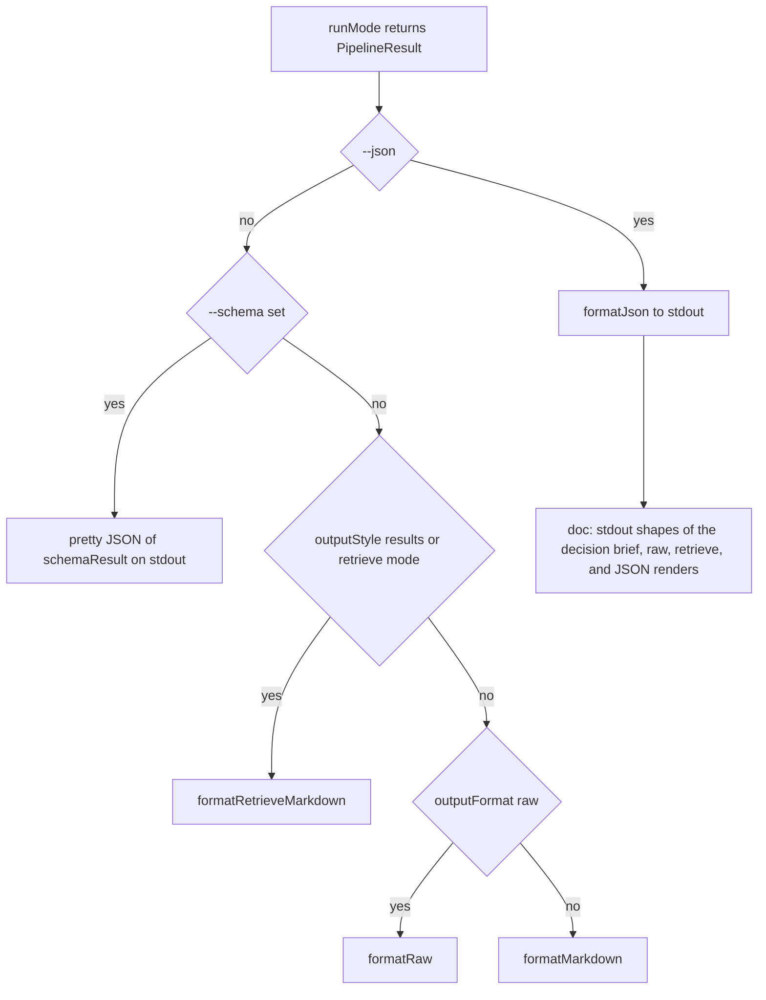
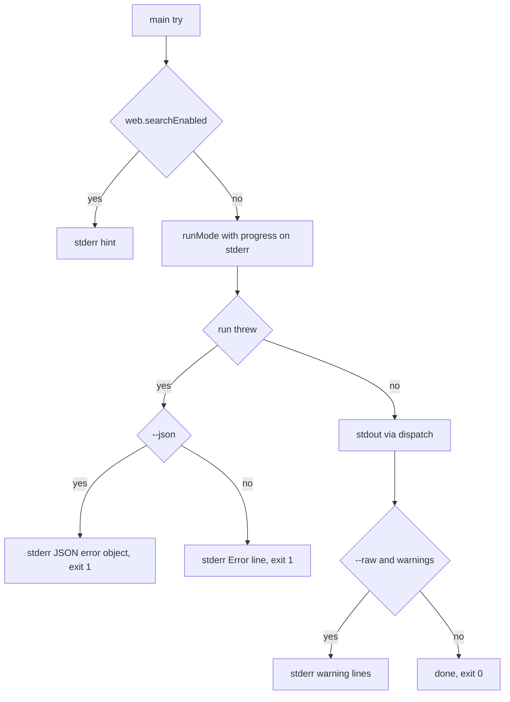

# Result model & output formatting

Every run of the CLI ends in one `PipelineResult` object (`src/types.ts`) that all mode
pipelines build and `src/formatters.ts` renders. The contract separates *what happened*
(the structured result) from *how it is shown* (the formatter), so one object feeds four
stdout shapes — Markdown decision brief, raw model text, retrieve results markdown, and
the `--json` payload — plus the stderr channel for hints, progress, warnings, and errors.

The two modules cooperate like this:

| Module | Responsibility |
|---|---|
| `src/types.ts` | `PipelineResult` (the one result contract), `DecisionAnswer`, `SearchResult` / `RetrieveResult`, `Source`, `UsageSummary`, `XSignalResult`, `BookmarkSearchResult` |
| `src/modes.ts` | Builds and normalizes the result per mode branch (`normalizeResult`, `normalizeRetrieveResult`, `normalizeSchemaResult`), runs `parseDecisionAnswer`, attaches xSignal/bookmarks |
| `src/formatters.ts` | Pure renderers: `formatMarkdown`, `formatRaw`, `formatRetrieveMarkdown`, `formatJson`, `formatError`, and the footer / X report / sources helpers |
| `src/retrieval.ts` | Parses the model's retrieve JSON (`parseRetrieveContent`) and merges web sources into `SearchResult[]` with heuristic scores |
| `src/cli.ts` | The only caller of the renderers: picks the stdout shape from flags and writes stdout/stderr |

`src/cli.ts` wires the pipeline into the renderers (`src/cli.ts#L34-L59`): after `runMode`
returns, it selects exactly one stdout formatter per invocation, and the catch block routes
all failures through `formatError` on stderr with exit code 1.

## The `PipelineResult` contract

```ts
interface PipelineResult {
  mode: CanonicalMode;        // "auto" | "fast" | "expert" | "deepresearch" | "multi" | "retrieve"
  profile: Profile;           // "quality" | "economy"
  outputFormat: OutputFormat; // "brief" | "report" | "raw"
  content: string;
  answer?: DecisionAnswer;
  sources: Source[];
  warnings: string[];
  usage: UsageSummary;
  web?: PipelineWebInfo;                 // { searchEnabled, fetchEnabled }
  searchResults?: SearchResult[];        // retrieve mode / --retrieve / --output results|both
  schemaResult?: unknown;                // --schema
  xSignal?: XSignalResult;               // --x
  bookmarks?: BookmarkSearchResult;      // --bookmarks
}
```

### Required fields

- **`mode`, `profile`, `outputFormat`** — the canonicalized mode (deprecated `research`
  is mapped to `deepresearch`), the resolved profile, and the output format. Every
  normalization function (`normalizeResult`, `normalizeRetrieveResult`,
  `normalizeSchemaResult` in `src/modes.ts`) stamps these from the user's resolved options,
  overwriting the `"auto"` / `"quality"` / `"raw"` placeholders the OpenRouter client puts
  on its per-call results.
- **`content`** — the model's text (or the retrieve-mode answer / bookmarks / X markdown
  for the `--only` short-circuits). In `--json` mode with a successful decision-answer
  parse, `content` retains the raw model JSON string while `answer` carries the parsed
  object.
- **`sources`** — `{ url, title? }` list derived from OpenRouter `citations` plus
  `url_citation` annotations, deduped by URL in `extractSources`; retrieve-mode runs add
  the citation-derived entries even when the model's JSON listed fewer URLs.
- **`warnings`** — deduped, ordered list (mode deprecations, x/bookmark warnings,
  two-pass notes, parse failures). `dedupeWarnings` keeps first occurrence.
- **`usage`** — `UsageSummary` totals plus per-call `calls[]`; `costUsd` is present only
  when every call reported a cost (see the OpenRouter client page).
- **`web`** — always present after normalization: `{ searchEnabled, fetchEnabled }`,
  `false`/`false` for modes that cannot use OpenRouter web tools (`deepresearch`, `multi`)
  and for the `--x-only` / `--bookmarks-only` short-circuits.

### Optional fields and when they populate

| Field | Populated when | Where set |
|---|---|---|
| `answer` | `--json` on a brief-style single/merged Grok result, **not** in retrieve, `--schema`, or `--output results` runs | `normalizeResult` via `parseDecisionAnswer` (see below) |
| `searchResults` | retrieve mode, `--retrieve`, or `--output results`/`both` on web-capable modes | `normalizeRetrieveResult` from `parseRetrieveContent` + `mergeRetrieveResults` |
| `schemaResult` | `--schema` (inline JSON or file) — parsed `result.content`; omitted when the model's JSON is invalid and the raw text stays in `content` | `normalizeSchemaResult` |
| `xSignal` | `--x` succeeded (Grok agent `/whathappened`); warnings folded into `warnings` | `attachXSignal` (via `attachContext`) |
| `bookmarks` | `--bookmarks` produced or skipped a TweetSmash search; skipped state surfaces a warning, hits are injected into prompts | `attachBookmarks` (via `attachContext`) |

Several optional fields are deliberately **mutually exclusive** by normalization:

- `answer` is dropped in schema runs (`normalizeSchemaResult` discards it) and in retrieve
  runs (`normalizeRetrieveResult` drops it) — the tests assert `result.answer` stays
  `undefined` for both retrieve and `--schema`.
- `--x-only` and `--bookmarks-only` conflict (`Cannot combine --x-only with
  --bookmarks-only.`) and each short-circuit returns early with `emptyUsage()` and
  `web: { searchEnabled: false, fetchEnabled: false }`.
- `schemaResult` is never set when `JSON.parse(result.content)` throws or yields
  non-JSON; instead the warning `--schema output was not valid JSON; schema_result is
  omitted. The raw model text is in content.` is added.

## From invocation to stdout shape

`src/cli.ts#L48-L59` chooses the stdout renderer in strict flag priority:

1. **`--json`** — always `formatJson(result)`; this beats every other shape, including
   `--schema` and `--retrieve` (schema runs also set `schemaResult` so the JSON payload
   carries it).
2. **`--schema` without `--json`** — pretty-printed `JSON.stringify(
   result.schemaResult ?? null, null, 2)`; the human-readable schema mode prints the
   structured object rather than the surrounding brief.
3. **`--output results` or `retrieve` mode** — `formatRetrieveMarkdown(result)`.
4. **`--raw`** — `formatRaw(result)`.
5. **default** — `formatMarkdown(result)` (decision brief, or research report when
   `--report` set `outputFormat`).



Caption: `cli.ts` output dispatch — one stdout format per invocation, `--json` wins over all other shapes.

## Markdown renders

`formatMarkdown(result)` composes, in order:

1. `content.trim()`
2. `## Sources` — appended only when sources exist **and** the content does not already
   contain a `## Sources` heading (regex `/(^|\n)## Sources\b/i`), so model-authored
   source sections are never duplicated. Each line is `- Title: url` or `- url`.
3. The X report appendix (below).
4. `## Warnings` — bulleted list, only when warnings exist.
5. The footer (below).

`formatRaw(result)` is the same without sources and warnings: content + X report appendix
+ footer (`src/formatters.ts#L8-L10`). This is the "minimally shaped model output" shape;
the `raw` prompt instructs the model to answer directly with no framing.

The X report appendix (`xSignalAppendix`, `src/formatters.ts#L139-L144`) appends
`## X report\n- <reportPath>\n\n` **only when** `xSignal.reportPath` exists and
`result.content` does not already contain that path (the model brief often prints it),
preventing a doubled pointer. It is deliberately not the full X markdown dump — that lives
in the brief body and in the JSON payload's `x_signal` field.

### The footer line

`footer(usage)` (`src/formatters.ts#L109-L118`) renders a single line:

```text
---
Cost: $0.0120 | Models: x-ai/grok-4.20 | Tokens: 2,100 in / 800 out | Web searches: 2
```

- **Cost** — `formatCost` (`src/cost.ts#L35-L37`): `$<4-decimal>` when `costUsd` is
  known, else the literal `unavailable` (used identically by `--max-cost` enforcement).
- **Models** — distinct model names across `usage.calls`, comma-joined, or `unavailable`
  when there are no calls.
- **Tokens** — `toLocaleString()` of total prompt/completion tokens, `in / out`.
- **Tool usage** — `| Web searches: N` and/or `| Web fetches: N`, appended only when
  `serverToolUse.webSearchRequests` / `webFetchRequests` are present and greater than 0.

The same footer closes `formatRaw` and `formatRetrieveMarkdown`; the requests counts come
from the OpenRouter `server_tool_use` mapping, so they are absent for Sonar modes and
`--no-web` runs.

### Retrieve results markdown

`formatRetrieveMarkdown` (`src/formatters.ts#L14-L30`) renders the Tavily-style shape for
`--output results` and retrieve mode: an optional content block (the LLM `answer` for
`--output results`, the synthesis for `--output both`), then a `## Results` list where each
entry is:

```text
- **Title** (score: 0.9)
  https://example.com
  Snippet text
```

The `(score: …)` suffix appears only when `score !== undefined`; entries with a URL but no
title fall back to the URL as the bold label, and the snippet line is omitted when
`content` is empty. Warnings and the footer close the output. In `--output results` mode
without a model answer, `content` is normalized to `""` and the renderer skips the content
block entirely (asserted by `test/formatters.test.ts`).

## The `--json` payload

`formatJson(result)` (`src/formatters.ts#L32-L89`) emits a stable, 2-space-indented JSON
object:

| Key | Type | Source |
|---|---|---|
| `mode` | string | `result.mode` |
| `web` | object or omitted | `{ search_enabled, fetch_enabled }` — only when `result.web` exists |
| `profile` | string | `result.profile` |
| `output_format` | string | `result.outputFormat` |
| `answer` | object or `null` | snake_case of `DecisionAnswer` — `undefined` renders as `null` |
| `content` | string | `result.content` |
| `sources` | array | `result.sources` |
| `warnings` | array | `result.warnings` |
| `usage` | object | totals + `cost_usd` (or `null`), `server_tool_use`, `calls[]` with per-call `role`, `model`, `prompt_tokens`, `completion_tokens`, `cost_usd`, `server_tool_use` |
| `search_results` | array | only when `searchResults` is non-empty; each item keeps `title`, `url`, `content` plus optional `score` / `raw_content` / `favicon` |
| `schema_result` | any | only when `schemaResult !== undefined` |
| `x_signal` | object | only when `xSignal` present: `markdown`, `report_path` (or `null`), `session_id` (or `null`), `cost_usd` (or `null`), `warnings` |
| `bookmarks` | object | only when `bookmarks` present: `query`, `skipped`, `reason` (or `null`), `hits`, `related` |

Key details:

- **`answer` uses snake_case field names** (`key_facts`, `open_questions`, …) — camelCase
  keys like `answer.keyFacts` are asserted **absent** in the formatter tests; the parse
  side (`parseDecisionAnswer`) accepts the snake_case keys.
- **`search_results` and `schema_result` are absent, not `null`**, when their inputs are
  missing; `test/formatters.test.ts` asserts `output.search_results` is `undefined` for a
  plain brief result.
- **`x_signal` never includes `rawText`** — the JSON payload carries the markdown block,
  report path, session, cost, and warnings, but not the agent's raw transcript.
- Missing costs render as `null` (`cost_usd: result.usage.costUsd ?? null`), so a
  cost-less run still has a complete `usage` object readable by agents.

## stderr channel: hint, progress, warnings, errors

stdout carries only the result; all diagnostics go to stderr:

- **Web hint** — `hint: OpenRouter web search is enabled (--no-web to disable)` printed by
  `cli.ts` before the run whenever search is enabled.
- **Progress** — `console.error` step lines from `src/modes.ts` (`Step 1/2: Researching…`,
  `Step 2/2: Formatting decision JSON…`, `Bookmarks: searching TweetSmash library…`).
  Under `--json` most progress is suppressed, but the two-pass `--json` + web steps are
  still printed unconditionally. `--x` suppresses its progress via `jsonQuiet`.
- **Warnings** — in `--raw` (non-JSON) runs, `result.warnings` are echoed as
  `warning: <msg>` lines; the final `--max-cost` no-cost warning is always surfaced on
  stderr.
- **Errors** — `formatError(error, json)` (`src/formatters.ts#L91-L95`): with `--json` it
  emits `{"error":{"message":"<message>"}}` (2-space pretty JSON) so agents can parse
  failures; without it, plain `Error: <message>`. `wantsJson` scans the raw argv for
  `--json` so an error during argument parsing is still formatted as JSON when the flag was
  present. The CLI exits with code 1 on any non-help error (help exits 0 with `HELP_TEXT`
  on stdout).



Caption: stdout stays clean of diagnostics; hint, progress, warnings, and errors all flow to stderr, with `--json` shaping the error object.

## `parseDecisionAnswer` and its tolerances

`parseDecisionAnswer(content)` (`src/modes.ts#L676-L719`) turns the model's `--json`
response into the structured `DecisionAnswer` and is the model-tolerance boundary for the
whole result model. It is invoked only by `normalizeResult` when all of these hold:
`--json` is set, `--schema` is not, `--output brief` (not `results`), `--retrieve` is off,
and the mode is not `retrieve`.

Tolerances — **it never throws**:

1. **Non-JSON content** (markdown, prose, empty) → `warning:
   Model returned non-JSON content for --json (<preview>); answer fields omitted.` and no
   `answer`. The raw text stays in `content`.
2. **JSON that is not a decision object** (a bare number like `-1.5E-05` — the observed
   `json_object` + web-tools failure mode — a string, `null`, an array) → warning with the
   JSON type in the message; `answer` omitted.
3. **An object that is empty/garbage** (no recommendation and empty `key_facts` /
   `tradeoffs`) → warning `Model returned an empty or invalid decision JSON object;
   answer fields omitted.`; `answer` omitted.

Each failure path adds its warning to `result.warnings` (deduped with the existing list)
and the run still succeeds — the pipeline degrades to "content only" instead of aborting.

Field coercion is defensive: `recommendation` via `stringValue` (non-strings become `""`),
the four list fields via `stringArray` (only string array elements kept), and
`confidence` maps anything except exactly `"low"` or `"high"` to `"medium"`. The fenced
JSON case is handled by `stripJsonFences`, which unwraps a ``` ```json … ``` ``` block
before parsing, so models that fence their JSON (despite instructions) still parse.

## How optional fields reach the result

### `searchResults` (retrieve / `--retrieve` / `--output`)

The retrieve path (`runRetrieve` in `src/modes.ts`) sends a single JSON-instructed call
(`RETRIEVE_INSTRUCTION` asks for `{ results: [{title,url,content}], answer }`) and then
`parseRetrieveContent` (`src/retrieval.ts#L16-L34`) turns the response into
`ParsedRetrievePayload`. Tolerances mirror the decision-answer ones: invalid JSON, a
non-object payload, a non-array `results`, and entries missing a `url` all yield a safe
empty set instead of throwing. `mergeRetrieveResults` then overlays citation-derived
sources (`extractSources` re-exported from `openrouter.ts`) so URLs that only appear as
annotations are still represented; model-emitted entries win by URL, and every result
lacking a score gets a heuristic citation-order score rounded to 3 decimals —
`1 - index / count`, so earlier citations score higher, spanning `(0, 1]`.

`normalizeRetrieveResult` wires the pieces and encodes the `--output` semantics:

- `--output results` → `content` is the optional LLM `answer` (or `""`), and the CLI
  renders the results markdown.
- `--output both` → a second synthesis call (no web tools; grounding is already in the
  retrieved sources block) replaces `content` with the synthesized brief; usage merges
  across the two calls.
- retrieve mode with `--json` → `content` stays the raw retrieve JSON and the caller is
  expected to read `search_results`.

### `schemaResult` (`--schema`)

`normalizeSchemaResult` (`src/modes.ts#L501-L531`) does one `JSON.parse` of the emit call's
content. On success `schemaResult` is set; on failure it stays unset with the "not valid
JSON" warning. The mode dispatch warning (`--schema overrides deepresearch mode; using a
single Grok call…`) is added when schema takes over a non-web mode, and the web two-pass
variant merges research + format usage and sources.

### `xSignal` (`--x`) and `bookmarks` (`--bookmarks`)

`attachContext` (and the `attachXSignal` / `attachBookmarks` helpers, `src/modes.ts#L315-L339`)
append both optional blocks onto whatever the mode branch returned, folding each signal's
warnings into the result's deduped `warnings`. The early `--x-only` / `--bookmarks-only`
branches instead build the result *from* the signal: `buildXOnlyResult` wraps
`xSignal.markdown` in a `# X Signal Brief` with an `**HTML report:**` line, and
`buildBookmarksOnlyResult` renders `# Saved Bookmarks Brief` from
`formatBookmarksMarkdown` with sources derived from bookmark hits; both use `emptyUsage()`.

## Focused tests

- `test/formatters.test.ts` — footer content (cost, models, `Web searches: 2`), stable
  JSON field names (`key_facts` not `keyFacts`), `null` cost fields when unavailable,
  presence/absence of `search_results` and `schema_result`, X report appendix, retrieve
  markdown with scores and without content.
- `test/modes.test.ts` — `parseDecisionAnswer` accepts a valid object and rejects bare
  numbers (`-1.5E-05` → "not a decision object") and non-JSON markdown with warnings
  rather than throws; normalizeResult skips answer parsing for retrieve and `--schema`;
  `--output results` moves the model answer into `content`; the retrieve path never sets
  `answer`.
- `test/retrieval.test.ts` — `parseRetrieveContent` empty-safe parsing, URL-missing entry
  skipping, `mergeRetrieveResults` precedence and score assignment, `resultsFromSources`
  descending citation-order scores.
