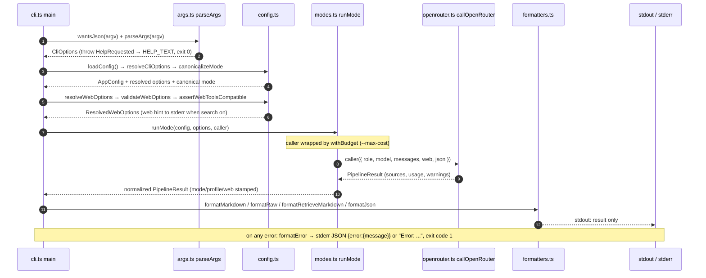

# System overview & runtime domains

`grok-cli` is a zero-dependency TypeScript/Node CLI (Node ≥ 20, ESM) that turns one
prompt into a grounded, cited research result by calling OpenRouter chat completions —
xAI Grok models for reasoning and Perplexity Sonar models for deep factual research.
It is built for humans and for coding agents: the default output is a Markdown decision
brief, and `--json` emits a stable payload for machine consumers. A single run fans out
into **1 to 5+ model calls** depending on mode (see the pipeline page), and every call
goes through one shared OpenRouter wrapper so retries, error mapping, source parsing,
and cost accounting behave identically everywhere.

The runtime is organized into five domains:

| Domain | Responsibilities | Where documented |
|---|---|---|
| **CLI surface** | `src/cli.ts` entrypoint + `src/args.ts` flag parsing, `src/config.ts`/`src/defaults.ts` precedence, help text, exit codes | [this page](#entrypoint-and-module-map) |
| **Pipeline orchestration** | `src/modes.ts` `runMode` dispatch, `withBudget` cost cap, two-pass patterns, result normalization; `src/prompts.ts` prompt builders | [pipeline](/openwiki/architecture/pipeline.md) |
| **Provider client** | `src/openrouter.ts` chat-completions wrapper (retries, status→error mapping, tool building, sources), `src/cost.ts` usage aggregation | [openrouter-client](/openwiki/architecture/openrouter-client.md) |
| **Result model & rendering** | `PipelineResult` in `src/types.ts`, `src/formatters.ts` markdown/JSON/raw renders, `src/retrieval.ts` search-result parsing | [output-and-formatting](/openwiki/architecture/output-and-formatting.md) |
| **Modes & routing** | Mode semantics, quality/economy model aliases, web-tool compatibility | [modes-and-routing](/openwiki/concepts/modes-and-routing.md) |
| **Integrations & workflows** | `--x` native X signal (`src/x-signal.ts`), `--bookmarks` TweetSmash (`src/bookmarks.ts`), `multi` and `retrieve` workflows | [x-signal](/openwiki/integrations/x-signal.md), [tweetsmash-bookmarks](/openwiki/integrations/tweetsmash-bookmarks.md), [multi-agent](/openwiki/workflows/multi-agent.md), [retrieval](/openwiki/workflows/retrieval.md) |

The design spec (docs/specs/2026-05-19-grok-cli-design.md) describes the original
architecture; source code and tests are authoritative where the two have drifted.

## Entrypoint and module map

`src/cli.ts` is the **only** entrypoint. `package.json` maps the `grok-research` bin to
`dist/cli.js`, which `tsup src/cli.ts` produces; the dev checkout runs the same file
directly via `pnpm dev` / `pnpm grok-research` (`tsx src/cli.ts`). `main()` runs at
module top level (`await main()`), so a launched process always enters through it.

| Module | Responsibility |
|---|---|
| `src/cli.ts` | Sole entrypoint: parses argv, loads config, canonicalizes mode, resolves/validates web options, prints the web hint, wires the OpenRouter caller into `runMode`, dispatches the result to a formatter on stdout, and formats errors on stderr with exit code 1. `HelpRequested` from arg parsing prints `HELP_TEXT` and exits 0. |
| `src/args.ts` | Pure argv parsing: positional mode token (only the first non-flag argument), all flag families (mode, output, web, x, bookmarks, profile, json/schema, `--max-cost`), `--` terminator, `wantsJson` pre-scan for JSON-shaped errors, `HELP_TEXT`. |
| `src/config.ts` | Config load/merge (defaults ← `~/.config/grok-cli/config.json` ← `OPENROUTER_API_KEY` env), model alias resolution, `canonicalizeMode` (`research` → `deepresearch`), `resolveWebOptions`/`validateWebOptions`/`assertWebToolsCompatible`. |
| `src/defaults.ts` | Hardcoded `DEFAULT_CONFIG`: quality/economy model alias tables, web search/fetch defaults, default mode `auto`, default profile `quality`. |
| `src/modes.ts` | `runMode` pipeline: mode dispatch, `withBudget` `--max-cost` wrapper, x/bookmarks signal gathering, schema/retrieve/multi/deepresearch branches, two-pass `--json`/`--schema` + web, normalization and `parseDecisionAnswer`. |
| `src/prompts.ts` | System/user message builders per output format and mode: decision brief, report, raw, retrieve JSON contract, role analyses, synthesis, schema-constrained, X/bookmark injection. |
| `src/openrouter.ts` | OpenRouter `/api/v1/chat/completions` wrapper: server-tool construction, 3-attempt retry with backoff, status→error mapping, source extraction, response normalization to `PipelineResult`. |
| `src/formatters.ts` | Pure stdout renders: `formatMarkdown`, `formatRaw`, `formatRetrieveMarkdown`, `formatJson`, `formatError`; footer/X report/warnings helpers. |
| `src/retrieval.ts` | Parses the model's retrieve JSON (`parseRetrieveContent`, never throws), merges citation sources into Tavily-style `SearchResult[]` with heuristic citation-order scores. |
| `src/cost.ts` | Pure usage accounting: `emptyUsage`, `addUsageCall`, `mergeUsage`, `formatCost`; `costUsd` only when every call reported a cost. |
| `src/x-signal.ts` | Native X signal: spawns the `grok` agent headless to run `/whathappened`, parses the machine-readable marker block, report path, session/cost; nested-`--x` guard. |
| `src/bookmarks.ts` | TweetSmash REST bookmark search (keyword + semantic), related authors/tags/terms pass, skip semantics, markdown formatting. |
| `src/types.ts` | Shared contracts: modes/profiles, `CliOptions`, `AppConfig`, `PipelineResult`, `OpenRouterRequest/Response`, usage/sources, x/bookmark shapes. |

## Request lifecycle

The sequence pins the two invariants that give the whole system its shape:

1. **One client, many callers.** `cli.ts` constructs the only OpenRouter caller —
   `(call) => callOpenRouter(config.openrouter, call)` — and passes it into `runMode`;
   every branch (single Grok call, two-pass research+format, multi's 5 legs, retrieve,
   deepresearch) funnels through the same retry/error/source/usage path.
2. **Mode is chosen, then everything else is derived.** After `canonicalizeMode`
   (deprecated `research` → `deepresearch`, with a warning) the mode decides: which
   models to resolve, whether OpenRouter web tools can attach (`modeAllowsWeb`:
   `auto`/`fast`/`expert`/`retrieve` only), whether retrieve semantics apply, and which
   normalization stamps `mode`/`profile`/`outputFormat`/`web` onto the result.

`--max-cost` wraps the caller in `withBudget` before any dispatch: cumulative spend is
tracked per call and `MaxCostExceededError` aborts immediately (before a pre-check, and
after a post-check), so under `multi` the money-consuming analysis legs switch from
parallel to sequential dispatch to stop fresh billable calls the moment the cap is hit.
The guard degrades to a stderr warning when any call's cost is unknown, since an
unenforced cap must stay visible.

## stdout / stderr split and exit-code contract

The contract is: **stdout carries only the result; every diagnostic goes to stderr.**

- **exit 0** — a run that produced a `PipelineResult` (even one with warnings, or with a
  `parseDecisionAnswer` failure that degraded to content-only).
- **exit 1** — any thrown error, set via `process.exitCode = 1` in the catch block:
  missing prompt, unknown flag, missing API key, web-option conflicts, model
  incompatibility, OpenRouter/provider failures, `MaxCostExceededError`, and multi's
  fatal conditions. With `--json` on the command line, `formatError` emits
  `{"error":{"message":"..."}}` (2-space pretty) on stderr so agents can parse failures;
  `wantsJson` scans the raw argv so parse-stage errors are still JSON-shaped. Without it,
  the plain line `Error: <message>` is printed. `-h`/`--help` is the exception: it prints
  `HELP_TEXT` to stdout and exits 0.

stderr channels, in order of appearance:

- **Hint** — `hint: OpenRouter web search is enabled (--no-web to disable)` printed by
  `cli.ts` before the run whenever `web.searchEnabled` is true.
- **Progress** — `Step N/M: ...` lines from `src/modes.ts` and the
  `Bookmarks: searching TweetSmash library...` line; most are suppressed under `--json`
  (the two-pass `--json` + web steps and `--x`'s spawn line are notable exceptions).
- **Warnings** — deprecated-flag and ignored-flag warnings rendered as `warning: <msg>`
  on stderr in non-JSON `--raw` runs, plus the always-on `--max-cost` unknown-cost warning.
- **Errors** — always `formatError`, JSON when `--json` was requested.

The stdout shape per invocation is one of (strict priority): `--json` → `formatJson`;
`--schema` without `--json` → pretty JSON of `schemaResult`; retrieve/`--output results`
→ `formatRetrieveMarkdown`; `--raw` → `formatRaw`; default → `formatMarkdown` (brief or
report). Full details on the payload keys, footer line, and derive-from-result fields
live on the [output-and-formatting](/openwiki/architecture/output-and-formatting.md)
page.

## Configuration and precedence

Config resolution happens in `loadConfig` (`src/config.ts`): hardcoded
`DEFAULT_CONFIG` (src/defaults.ts) is merged with `~/.config/grok-cli/config.json` when
present, then `OPENROUTER_API_KEY` from the environment overrides the file's
`openrouter.apiKey`. `resolveCliOptions` fills `mode` and `profile` from config defaults
only when the CLI did not set them explicitly. Per-run resolution adds CLI web overrides
(`--no-web`, `--web-fetch`, engine/limits/domains) over the config's `web.search` /
`web.fetch` blocks, with `validateWebOptions` rejecting conflicting allow+block domain
lists and `--web-fetch` without web search, and `assertWebToolsCompatible` rejecting
Perplexity models (`perplexity/` cannot run OpenRouter server tools) when web is on.
Missing `OPENROUTER_API_KEY` fails at the first model call with a message naming both
the env var and the config file location. See
[the module map](#entrypoint-and-module-map) for the alias tables.

## Runtime domains in depth

- **CLI surface** — flag grammar (positional mode token recognized only as the first
  non-flag argument, `--` prompt terminator, unknown-option errors), help text, program
  name via `GROK_PROGRAM_NAME`.
- **Pipeline** — dispatch order in `runMode`: `--x-only`/`--bookmarks-only`
  short-circuits (mutually exclusive), `--schema` takeover (single call, or two-pass with
  web), `multi` (5 calls), retrieve path (`--retrieve`/`--output results|both` on
  web-capable modes), `deepresearch` (1 Sonar call), then the default single Grok call —
  with the two-pass `--json` + web variant because `response_format json_object` must
  never be combined with server tools.
- **Provider client** — 3-attempt retry (429/≥500/fetch `TypeError`), exponential
  backoff with `Retry-After` override, strict status→error branching (auth 401/403,
  credits 402, tool-support 404, model-unavailable 404, provider 429/5xx), sources
  deduped from `citations` + `url_citation` annotations, per-call usage aggregation
  where aggregate `costUsd` exists only when every call reported one.
- **Result model** — one `PipelineResult` object flows from every mode through every
  formatter; optional fields (`answer`, `searchResults`, `schemaResult`, `xSignal`,
  `bookmarks`) populate per mode branch and are deliberately mutually exclusive where
  normalization drops them.

## Focused tests that pin the overview contracts

- `test/cli.test.ts` — real `spawnSync` end-to-end: `pnpm tsx src/cli.ts --json` with no
  prompt exits 1 and prints exactly `{"error":{"message":"Missing prompt"}}` on **stderr**.
- `test/args.test.ts` — parse shapes, positional mode recognition, `--` terminator,
  unknown-flag and missing-prompt errors, `wantsJson` pre-scan.
- `test/config.test.ts` — defaults, config-file merge, `OPENROUTER_API_KEY` precedence,
  web resolution/validation, Perplexity-tool incompatibility, config default mode/profile
  application.
- `test/modes.test.ts` — dispatch counts per branch (1-call expert, 2-call two-pass,
  5-call multi, sequential budget abort dispatching only `["research","engineering"]`),
  web-tool enable/disable per mode, deprecation warnings, multi partial-failure
  continuation, `parseDecisionAnswer` tolerances (bare number `-1.5E-05` → warning).
- `test/openrouter.test.ts` — tools parameter mapping, `response_format` never combined
  with tools, retry sequencing, error-message branches, source merging.
- `test/formatters.test.ts` — footer, stable JSON snake_case keys, absent-vs-null
  optional fields, retrieve markdown, X report appendix.

See [testing](/openwiki/testing/overview.md) for the full per-module invariant map and
mock patterns (`ModeCaller` fakes for `runMode`, `fetchImpl` for HTTP, `spawnImpl` for
`--x`).
