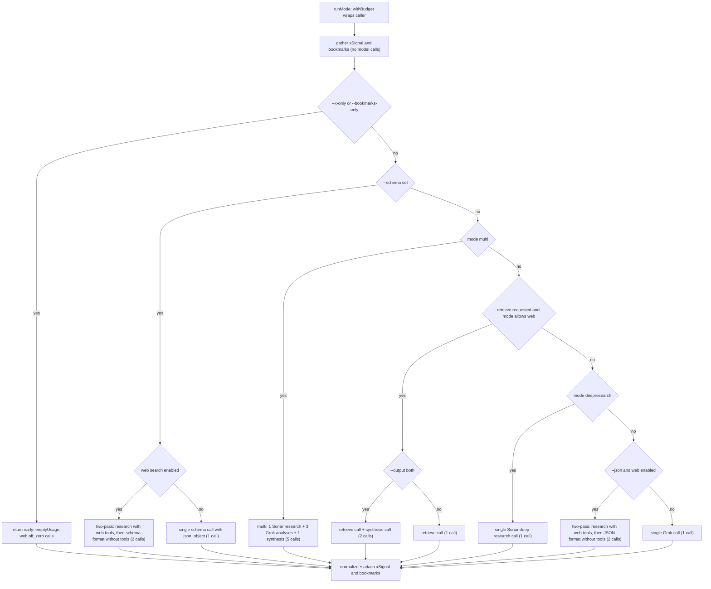
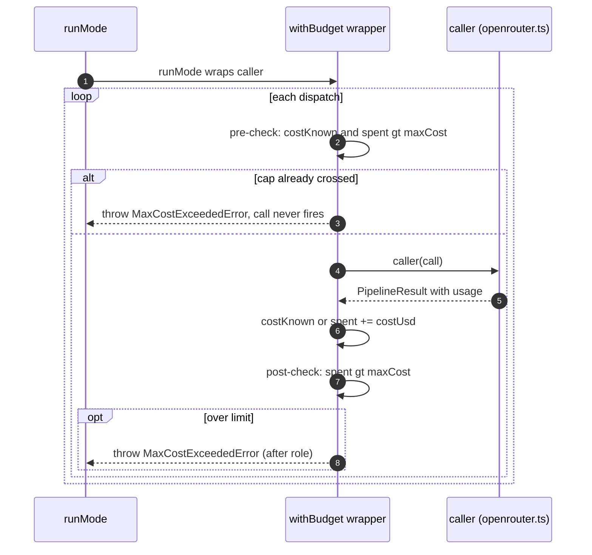

# Pipeline orchestration (runMode)

`src/modes.ts` is the pipeline orchestrator: one exported entrypoint, `runMode(config, options, caller)`, turns a resolved `CliOptions` + the single OpenRouter caller into a normalized `PipelineResult`. Everything between the CLI surface ([overview](/openwiki/architecture/overview.md), which canonicalizes the mode and resolves web options) and the OpenRouter client ([openrouter-client](/openwiki/architecture/openrouter-client.md), which performs each per-call HTTP request) happens here: mode dispatch, prompt assembly via `src/prompts.ts`, budget enforcement, X/bookmark signal gathering, multi-leg fan-out, retrieve parsing, and result normalization.

The caller contract (`ModeCall`) carries everything a branch can vary per call — `role`, `model`, `messages`, `temperature`, `json`, and `web` — and always returns a `PipelineResult`. `src/cli.ts` injects the one real caller, `(call) => callOpenRouter(config.openrouter, call)`, so every branch funnels through the same retry/error/source/usage path.

## Entrypoint and responsibilities

| Responsibility | Where |
|---|---|
| Wrap the caller in `withBudget` (cumulative `--max-cost` enforcement) | `withBudget`, `MaxCostExceededError` (`src/modes.ts#L43-L66`) |
| Canonicalize mode (`research` → `deepresearch` with warning), resolve web options, collect deprecation warnings, run `--x` and `--bookmarks` signals before any model call | `runMode` head (`src/modes.ts#L86-L142`) |
| `--x-only` / `--bookmarks-only` short-circuits (early return, zero model calls, `emptyUsage`) | `buildXOnlyResult` / `buildBookmarksOnlyResult` (`src/modes.ts#L133-L139`, `L341-L397`) |
| `--schema` dispatch — takes over the single-call path regardless of mode; two-pass with web | `runMode` schema block (`src/modes.ts#L147-L197`) |
| `multi` fan-out — Sonar research, 3 parallel (or sequential-under-budget) Grok role analyses, Grok synthesis | `runMulti` (`src/modes.ts#L548-L633`) |
| Retrieve path — retrieval-focused call emitting Tavily-style results, optional synthesis for `--output both` | `runRetrieve` (`src/modes.ts#L399-L464`) |
| `deepresearch` — single Sonar call, no OpenRouter web tools | `runMode` deepresearch branch (`src/modes.ts#L225-L237`) |
| Single Grok call (the fallback for `auto` / `fast` / `expert`), with the `--json` + web two-pass | `runMode` tail (`src/modes.ts#L239-L307`) |
| Result normalization — stamps `mode`/`profile`/`outputFormat`/`web`, merges and dedupes warnings, parses `answer`/`schemaResult`/`searchResults` | `normalizeResult`, `normalizeRetrieveResult`, `normalizeSchemaResult`, `parseDecisionAnswer`, `dedupeWarnings` |
| Attach `xSignal` / `bookmarks` payloads and fold their warnings into the result | `attachContext` / `attachXSignal` / `attachBookmarks` (`src/modes.ts#L315-L339`) |



Caption: `runMode` dispatch order and per-branch model-call counts. Every branch ends in a normalizer that stamps `mode`/`profile`/`outputFormat`/`web` and attaches the optional X/bookmark payloads.

## Dispatch order and branch semantics

Dispatch is a strict priority chain: **schema → multi → retrieve → deepresearch → single Grok call**. The `--schema` branch runs first and takes over the single-call path regardless of mode. The retrieve branch activates not only for `mode === "retrieve"` but also for `--retrieve` or `--output results`/`both` on any web-capable mode; on non-web modes (`deepresearch`, `multi`) those flags are ignored with a warning. `deepresearch` is dispatched before the generic Grok tail so Sonar never gets OpenRouter web tools.

### Single-call Grok tail (`auto` / `fast` / `expert`)

The fallback path resolves the model by role (`auto` → `expert` alias, `fast` → `fast` alias, `expert` → `expert` alias) and makes one `buildSingleCallMessages` call at temperature 0.2 with `options.json` and the resolved `web` options. When `--json` and web are *both* on it instead runs the two-pass pattern below. When `--json` is on without web, one call with `json: true` suffices because the client can safely combine `json_object` with no tools (`test/modes.test.ts#L153-L177`).

### Two-pass invariant for `--json` + web and `--schema` + web

When `--json` (or `--schema`) is combined with web search, the pipeline never sends a single request with both `json_object` and server tools: observed real responses on Grok + `web_search` under `json_object` collapse to garbage JSON (e.g. a bare `-1.5e-05`) after heavy search context is injected. The client enforces the same rule mechanically (`callOpenRouter` only sets `response_format` when `json && model supports it && !tools`), and the pipeline resolves the combination with two passes:

1. **Research pass** — `role: "expert"` (or `"schema_research"` for `--schema`), `json: false`, web tools attached, temperature 0.2.
2. **Format pass** — `role: "json_format"` (or `"schema"` for `--schema`), `json: true`, **no web tools**, temperature 0.1, messages built by `buildJsonFromResearchMessages` / `buildSchemaFromResearchMessages` from the research content plus its source URLs.

The two results are merged (sources concatenated, warnings concatenated, `mergeUsage` over both calls) and the decision-answer/schema parse runs on the merged content. For `--json` a warning `Used two-pass --json + web (research then JSON format) to avoid json_object+tools failures.` is added. With web disabled the schema branch is a single call (`buildSchemaMessages`, `json: true`, web attached), and `--json` without web is a single call.

### `--schema` overrides mode

The schema block runs before every other branch and uses one model resolution — `fast` alias for `fast` mode, else the `expert` alias — regardless of `deepresearch` or `multi`. When the effective mode is `deepresearch` or `multi`, a warning is pushed: `--schema overrides <mode> mode; using a single Grok call with schema-constrained output instead.` The schema source is either inline JSON (if it parses) or a file path (`loadSchema`); an unreadable path throws.

### `multi` — the 5-call ensemble

`runMulti` performs 1 Sonar research call (`research` alias, `buildResearchMessages` with `"report"`), 3 Grok role analysis calls (`engineering`, `product`, `skeptic` — `buildRoleAnalysisMessages`), and 1 Grok synthesis call (`buildSynthesisMessages`, `json: options.json`). No leg carries web tools (asserted in `test/modes.test.ts#L248-L251`). Analysis legs run in **parallel** by default; with `--max-cost` they run **sequentially** via `runSequential` so the budget pre-check stops dispatching fresh billable legs the moment cumulative spend crosses the cap. Partial role failure is tolerated: failed roles become `"<role> analysis failed: <reason>"` warnings and synthesis proceeds, but a budget abort in any leg is rethrown (fatal) rather than demoted to a warning, and if *all* roles fail the run throws `Multi-agent mode failed because all Grok analysis roles failed`. A failed research call fails the run. `usage` merges research + analyses + synthesis; `sources` concatenates research and synthesis sources.

### Retrieve path

The retrieve branch fires for `mode === "retrieve"` (web search forced on per `resolveWebOptions`) and for `--retrieve` / `--output results`/`both` on web-capable Grok modes. One call (`role: "retrieve"`, `buildRetrieveMessages`, `json: true`, temperature 0.1, web attached) emits a JSON payload of `{ results: [{title,url,content}], answer }`; `parseRetrieveContent` (never throws) plus `mergeRetrieveResults` (citation-order heuristic scores, model results win by URL) build `searchResults`. With `--output both`, a second `synthesis` call (temperature 0.2, **no web tools** — grounding is already in the retrieved sources block) writes the Markdown brief. `mergeUsage` combines both calls.

## Budget enforcement: `withBudget` and `MaxCostExceededError`

`runMode` wraps the raw caller before any dispatch:

```ts
const caller = withBudget(rawCaller, options.maxCost);
```

When `maxCost` is set, the wrapper keeps a running `spent` (USD) plus a `costKnown` flag:

- **Pre-check** before each call: if `costKnown && spent > maxCost`, throw `MaxCostExceededError` without firing the call.
- After each call: add `result.usage.costUsd` to `spent`; if the call's cost is `undefined`, `costKnown` flips to `false` (the total is unknown and enforcement degrades to a `cli.ts` stderr warning — see below). If `costKnown && spent > maxCost`, throw immediately after the call that crossed the cap.

The error message pins the exact abort point: `Cost $<spent> exceeded limit of $<limit> (aborted after "<role>")`. Because each call only reports its cost *after* it completes, the worst case bills the leg that detects the overrun — the wrapper cannot know a call's cost without making it. The sequence-multi mode, plus the pre-check, guarantee nothing after that leg is dispatched. A single call that itself exceeds the cap is caught by the post-check (`test/modes.test.ts#L257-L263`).



Caption: `withBudget` pre-check and post-check around every call. Multi analysis legs run sequentially under `--max-cost` so the pre-check stops dispatching once the cap is crossed.

A `MaxCostExceededError` thrown inside `runMulti`'s sequential legs aborts the whole run (rethrow, not warning), so `cli.ts`'s catch prints the error and exits 1. When the run *completes* but `result.usage.costUsd === undefined` under a set `--max-cost`, `cli.ts` prints `warning: --max-cost set ($X) but OpenRouter returned no cost; limit not enforced` so a silently-unenforced cap stays visible.

## X signal and bookmarks: gathering, attachment, and prompt injection

Before any model work, `runMode` gathers the optional signals:

- **`--x`** — `fetchXSignal` spawns the headless `grok` agent to run `/whathappened` (native X tools); its warnings join `deprecatedWarnings`.
- **`--bookmarks`** — `fetchBookmarkSignal` queries TweetSmash REST (keyword + semantic, plus related authors/tags/terms with `--bookmarks-related`); a skipped search (missing key, rate limit, network error) or empty hits produce warnings, never a hard failure. The full payload (`BookmarkSearchResult`) travels through `PipelineResult.bookmarks`.

Markdown is rendered once (`xSignal.markdown`, `formatBookmarksMarkdown`) and injected into prompts via `withContext` (through `buildSingleCallMessages`/`buildResearchMessages`/`buildSynthesisMessages`; `--schema` uses `withXInSchemaPrompt` and the retrieve synthesis block appends them to the sources block). The injected copy is framed as *sample context*: X is "not ground truth and not a substitute for docs, changelogs, or benchmarks", and bookmarks are "prior personal context", never live public opinion. The system prompt also gains short instructions to include `## X signal` / `## Saved bookmarks` sections when material. After the branch builds its result, `attachContext(result, xSignal, bookmarks)` attaches `PipelineResult.xSignal` / `.bookmarks` and folds their warnings into `result.warnings` (deduped). Injected text is *not* re-injected into the two-pass format pass: the research pass already consumed it, and the format messages only carry the research content plus source URLs.

### Short-circuits: `--x-only` and `--bookmarks-only`

`--x-only` returns `buildXOnlyResult` — a `# X Signal Brief` from the X markdown plus the HTML report pointer, `emptyUsage()`, `sources: []`, and `web: { searchEnabled: false, fetchEnabled: false }` (attached via `attachBookmarks`). `--bookmarks-only` returns `buildBookmarksOnlyResult` — a `# Saved Bookmarks Brief` whose `sources` are derived from hits and related groups (`url`, `@author`/`postId` title) — also with `emptyUsage()` and web off. Both are **zero model calls**: the model budget/usage stays empty and the short-circuit bypasses the entire dispatch chain. Combining them is an error: `Cannot combine --x-only with --bookmarks-only.` (`--x-only` requires a successful X signal and `--bookmarks-only` requires a bookmark result; each throws otherwise.) Because these results skip normalization, their `warnings` are `dedupeWarnings(extraWarnings [+ xSignal.warnings])` where `extraWarnings` is the same deprecation list every branch accumulates.

## Result normalization

Every non-short-circuit branch ends in one of three normalizers that transform the merged per-call results into the final `PipelineResult`:

| Normalizer | Stamps | Extra fields |
|---|---|---|
| `normalizeResult` | `mode`, `profile`, `outputFormat`, `warnings` (deduped), `web` (mode-correct: `false`/`false` for non-web modes) | `answer` when `--json` and no schema/retrieve/outputStyle/results and parse succeeds |
| `normalizeRetrieveResult` | same stamp set | `searchResults`, drops `answer`, content semantics per `--output` |
| `normalizeSchemaResult` | same stamp set | `schemaResult` when content parses as JSON; drops `answer`; parse-failure warning |

All three *overwrite* the placeholder `"auto"` / `"quality"` / `"raw"` the OpenRouter client puts on every per-call result, and re-resolve `web` from the canonical mode (`modeAllowsWeb`) rather than trusting `call.web`. Warnings are deduped across branch warnings, mode deprecations, x/bookmark warnings, and parse failures (`dedupeWarnings` keeps first occurrence).

### `parseDecisionAnswer`

For `--json` runs (without `--schema`, `--output results`, `--retrieve`, or retrieve mode), `normalizeResult` parses `result.content` into the `DecisionAnswer` shape (`recommendation`, `key_facts`, `tradeoffs`, `risks`, `open_questions`, `confidence`). It is deliberately tolerant:

- Non-JSON content and JSON that is not an object (e.g. a bare number like `-1.5e-05`, the observed `json_object`+tools failure mode) produce a warning — `Model returned non-JSON content for --json (...)` or `Model returned JSON that is not a decision object (...)` — and `answer` stays omitted. The content is preserved.
- Fenced JSON is unwrapped (`stripJsonFences`).
- Field coercion is lenient: `recommendation` only when string, arrays only keep strings, `confidence` maps anything other than `"low"`/`"high"` to `"medium"`.
- An empty recommendation plus empty `key_facts`/`tradeoffs` is treated as garbage: warning with content preview, `answer` omitted.

A parse failure never throws; the run still exits 0 with the raw content on the result.

## Failure and lifecycle semantics

- **Hard failures (exit 1):** missing/unknown flags and missing prompt (args), web-option conflicts and tool-incompatible models (`validateWebOptions`/`assertWebToolsCompatible` in `cli.ts`), missing API key and OpenRouter/provider errors (client), `MaxCostExceededError`, `--x-only`/`--bookmarks-only` without their signal, multi research failure, all-roles-failed, and the `--x-only`+`--bookmarks-only` conflict.
- **Partial failures (warnings, run continues):** deprecated mode/flag, skipped bookmarks, `--schema` overriding a non-Grok mode, `--retrieve`/`--output` ignored on non-web modes, individual multi role failures, `parseDecisionAnswer` and schema-parse failures, and X-signal marker fallbacks.
- **Early returns:** `--x-only` / `--bookmarks-only` short-circuits (no model calls, `emptyUsage`).
- **Progress channel:** step lines (`Step 1/2: Researching with web search...`) go to stderr and are gated on `!options.json` so `--json` stdout stays pure; the `--json` + web two-pass and `--schema` + web two-pass print `Step 1/2` / `Step 2/2`, `multi` prints `Step 1/3`…`Step 3/3`, and single-call branches print `Step 1/1`.

## Focused tests that pin the pipeline

- `test/modes.test.ts` — dispatch and call counts: expert routing with web (`L84-L101`), `--no-web` tool disable (`L103-L112`), **two-pass** `--json` + web asserting exactly 2 calls with `role: "expert"` (web, no json) then `role: "json_format"` (json, no web) plus the two-pass warning (`L114-L151`), single-pass `--json` without web (`L153-L177`), deepresearch model routing and deprecated `research` mapping (`L179-L218`), multi 5 calls with no web tools (`L233-L255`), `--max-cost` abort on a single call (`L257-L263`), sequential multi legs stop dispatching at the overrun (`L265-L276`), role-failure tolerance and all-failed fatal (`L315-L356`), retrieve routing, `--output results` content semantics, and the second synthesis call in `--output both` (`L358-L462`), `--schema` branch behavior including the deepresearch/multi override warnings and invalid-JSON tolerance (`L464-L553`), and `--retrieve` ignored on non-web modes (`L555-L581`).
- `test/modes.test.ts` `parseDecisionAnswer` suite (`L583-L611`) — valid object, bare-number rejection, non-JSON markdown rejection.
- `test/prompts.test.ts` — X/bookmark injection into system and user messages, web instruction presence, retrieve JSON contract, schema embedding.
- `test/retrieval.test.ts` — `parseRetrieveContent` never throws, `mergeRetrieveResults` scoring and URL precedence.
- `test/args.test.ts` — `--max-cost` parsing (`L95-L98`).
- `test/cost.test.ts` — `costUsd` present only when every call reports a cost (the invariant `withBudget`'s `costKnown` relies on).
