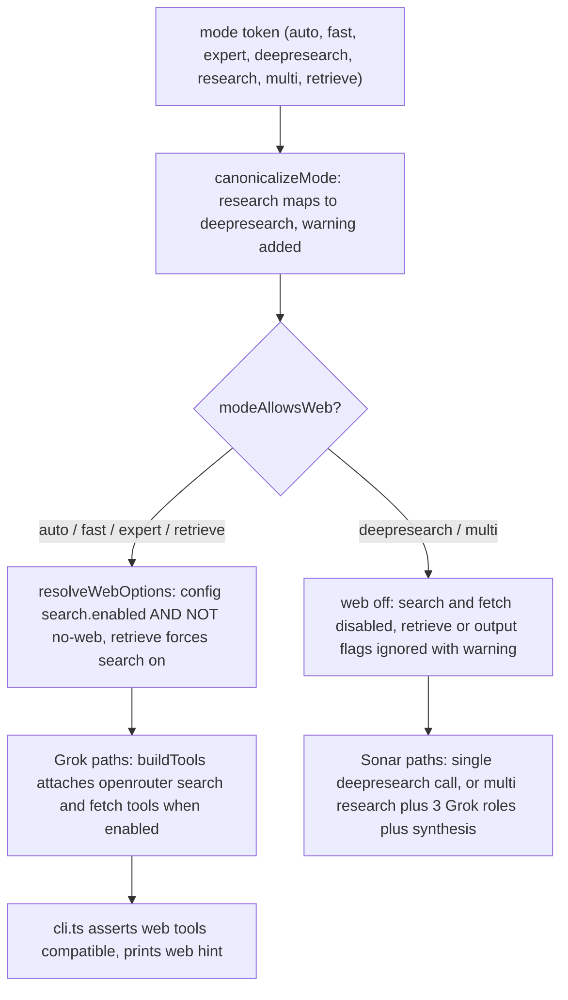

# Modes, model routing & web compatibility

Modes choose **which pipeline runs**, not the output format. The default mode is `auto`. After the CLI resolves options ([overview](/openwiki/architecture/overview.md)), mode routing happens in three layers in `src/config.ts`:

1. **`canonicalizeMode`** — normalizes the deprecated `research` token to `deepresearch` (with a warning) and produces the `CanonicalMode` used everywhere downstream.
2. **`resolveModel` / `resolveWebModel`** — map `(profile, alias)` to concrete OpenRouter model IDs from the quality/economy alias tables.
3. **`modeAllowsWeb` + `resolveWebOptions`** — decide whether OpenRouter server tools (`openrouter:web_search`, `openrouter:web_fetch`) may attach, then produce the resolved `ResolvedWebOptions` honored by `buildTools` in `src/openrouter.ts`.

The result is a decision matrix: mode → models → call count → web grounding behavior.

## Mode table

| Mode | Models | API calls | Web grounding |
|------|--------|-----------|---------------|
| `auto` | same as `expert` | 1× Grok | OpenRouter web search **on** (default); stderr hint each run |
| `fast` | `fast` alias (`x-ai/grok-4.3`) | 1× Grok | web search on (default) |
| `expert` | `expert` alias (`x-ai/grok-4.20`) | 1× Grok | web search on (default) |
| `deepresearch` | `deepResearch` alias (`perplexity/sonar-deep-research` / economy `perplexity/sonar-pro`) | 1× Sonar | Sonar only — no OpenRouter web tools |
| `research` | *(deprecated alias for `deepresearch`; same routing + warning)* | same | same |
| `multi` | `research` alias (Sonar) + `expert` alias (3× Grok roles + synthesis) | 5+ calls | Sonar pass only; Grok legs carry **no** web tools |
| `retrieve` | Grok (`expert` alias, or `fast` alias in fast mode) | 1× (+1 if `--output both`) | OpenRouter web search **forced on** |

Mode choice guidance: decisions/tradeoffs → `auto` / `expert` / `fast` (web on by default); deep factual research → `deepresearch` (Sonar deep — do **not** use default Grok); multi-perspective synthesis → `multi`; raw Tavily-style retrieval → `retrieve` or `expert --retrieve`.



Caption: mode routing layers — canonicalize → web gate → per-mode pipeline; Perplexity-based modes never receive OpenRouter server tools.

## Mode semantics and dispatch

`runMode` in `src/modes.ts` dispatches in strict priority order: **schema → multi → retrieve → deepresearch → single Grok call** (see [pipeline](/openwiki/architecture/pipeline.md)). Mode determines which branch runs:

- **`auto` / `fast` / `expert`** — one Grok call via `buildSingleCallMessages` at temperature 0.2, with the resolved `web` options attached. Web search is on by default. `--json` combined with web switches to a two-pass pattern (research with tools, then a tool-less `json_format` call) because `response_format json_object` must never combine with server tools. With web off, `--json` is a single call.
- **`deepresearch`** — one Sonar call (`role: "deepresearch"`, `buildResearchMessages`, temperature 0.2). Sonar performs its own native search; OpenRouter web tools are never attached.
- **`research`** — `canonicalizeMode` maps it to `deepresearch` and pushes warning `Mode "research" is deprecated; use "deepresearch" instead.` (asserted in `test/modes.test.ts#L196-L207`).
- **`multi`** — 5 calls: 1 Sonar `research` pass (`research` alias), 3 Grok role analyses (`engineering`, `product`, `skeptic`), 1 Grok `synthesis` call. No leg carries web tools (asserted in `test/modes.test.ts#L248-L251`). Analysis legs run in parallel by default, sequentially under `--max-cost`.
- **`retrieve`** — 1 call (`role: "retrieve"`, `buildRetrieveMessages`, `json: true`, temperature 0.1) that emits `{ results: [{title,url,content}], answer }`, parsed by `parseRetrieveContent` / `mergeRetrieveResults` into Tavily-style `searchResults[]`. `--output both` adds a second synthesis call (no web tools — grounding is already in the retrieved sources block).

The same retrieve branch activates for `--retrieve` or `--output results`/`both` on any web-capable mode, and `--schema` takes over the single-call path regardless of mode (with a warning when overriding `deepresearch` / `multi`).

## `modeAllowsWeb` — which modes can ground via OpenRouter

`modeAllowsWeb(mode)` returns true **only** for `auto`, `fast`, `expert`, and `retrieve`. `deepresearch`, `multi`, and the deprecated `research` (canonicalized to `deepresearch` before this check runs) never enable OpenRouter web tools **even with flags**: `resolveWebOptions` short-circuits on `modeAllowsWeb` before considering config or CLI flags, so `--web-fetch`, `--web-engine`, and friends are inert on those modes. If `--retrieve` or `--output results`/`both` is passed to a non-web mode, `runMode` pushes a warning — `--retrieve/--output was ignored in <mode> mode; this mode does not use OpenRouter web tools.` — and runs the normal pipeline (`test/modes.test.ts#L555-L581`).

Sonar models have their own grounding: `perplexity/sonar-deep-research` and `perplexity/sonar-pro` run native deep research server-side. `modeAllowsWeb` is a per-mode policy gate; `modelSupportsServerTools` is the per-model capability check below.

## Config file model aliases (`config.json` overrides)

Defaults are hardcoded in `src/defaults.ts` as `DEFAULT_MODELS` (quality and economy profiles × five aliases). Either profile can be overridden per-alias in `~/.config/grok-cli/config.json`.

**Quality** (default profile — `defaultProfile: "quality"`):

| Alias | Model |
|-------|--------|
| `fast` | `x-ai/grok-4.3` |
| `expert` | `x-ai/grok-4.20` |
| `research` | `perplexity/sonar-reasoning-pro` |
| `deepResearch` | `perplexity/sonar-deep-research` |
| `nativeMulti` | `x-ai/grok-4.20-multi-agent` |

**Economy** (`--economy`, or `defaultProfile: "economy"` in config):

| Alias | Model |
|-------|--------|
| `fast` | `x-ai/grok-4.3` |
| `expert` | `x-ai/grok-4.3` |
| `research` | `perplexity/sonar-pro` |
| `deepResearch` | `perplexity/sonar-pro` |
| `nativeMulti` | `x-ai/grok-4.3` |

`resolveModel(config, profile, alias)` is a plain table lookup (`config.models[profile][alias]`). `nativeMulti` is presently defined but **unused** — `multi` mode fans out to three single Grok calls rather than the `nativeMulti` model ID. Economy maps both `expert` and `fast` to `x-ai/grok-4.3`, and both `research` and `deepResearch` to `perplexity/sonar-pro`.

### Where roles pick aliases

| Pipeline position | Alias resolution |
|---|---|
| Single Grok call (`auto` / `fast` / `expert`), retrieve, and schema paths | `auto` → the **`expert`** alias; `fast` → the **`fast`** alias; `expert` → the **`expert`** alias (`src/modes.ts#L239-L241`, `L409`, `L153`) |
| Web-tool compatibility check inside `assertWebToolsCompatible` | `resolveWebModel(config, profile, mode)`: `role = mode === "auto" ? "expert" : mode; alias = role === "fast" ? "fast" : "expert"` (`src/config.ts#L63-L67`) |
| `deepresearch` | the **`deepResearch`** alias |
| `multi` research pass | the **`research`** alias; Grok legs and synthesis use the **`expert`** alias |
| `--profile` resolution | CLI `--economy` (explicit) wins over config `defaultProfile`; applied by `resolveCliOptions` |

Profile choice is stamped onto the result (`PipelineResult.profile`) — see [output-and-formatting](/openwiki/architecture/output-and-formatting.md).

## Web resolution precedence and compatibility gates

`resolveWebOptions(config, mode, web)` produces the final per-run web state:

```text
searchEnabled =
  modeAllowsWeb(mode)            # auto | fast | expert | retrieve only
  && (retrieve ? true : config.web.search.enabled)   # retrieve forces search on
  && !cli.noWeb                  # CLI --no-web wins over config
```

Key consequences (pinned in `test/config.test.ts#L58-L90` and `test/modes.test.ts#L56-L74`):

- **`--no-web` > config `web.search.enabled`** — the CLI flag disables search even when config enables it, on every web-capable mode including `retrieve`.
- **`retrieve` forces search on** — even when config has `web.search.enabled: false`, unless `--no-web` is passed. Fetch is *not* forced: `fetchEnabled = searchEnabled && (config.web.fetch.enabled || cli.fetchFlag)`, with the comment that `raw_content` extraction from `web_fetch` is not wired into `SearchResult` yet (users opt in with `--web-fetch`).
- **`multi` and `deepresearch` can never enable search** — the `modeAllowsWeb` term short-circuits regardless of config and flags.
- Config `web.search.engine / maxResults / maxTotalResults / allowedDomains / blockedDomains` and `web.fetch.engine / maxContentTokens` fill in when the CLI did not supply the corresponding flag.

`validateWebOptions` then rejects two conflicts before the run: combining `--web-allowed-domains` with `--web-blocked-domains`, and passing `--web-fetch` while search is disabled (`test/config.test.ts#L92-L112`).

`assertWebToolsCompatible(config, profile, mode, web)` runs in `cli.ts` before `runMode`. It only applies when web is enabled **and** the mode allows web; then it resolves the mode's web model and calls `modelSupportsServerTools(model)` — `!model.startsWith("perplexity/")`. A Perplexity override (e.g. `models.quality.expert: "perplexity/sonar-pro-search"`) with web on throws:

```text
Model <model> does not support OpenRouter server tools. Use a Grok model alias or run with --no-web.
```

(`src/config.ts#L80-L95`, asserted in `test/config.test.ts#L114-L134`.) The same truth is enforced mechanically in the client: `buildTools` returns `undefined` for `perplexity/` models, and a 404/tool-use error from OpenRouter maps to a message suggesting a Grok 4.x model or `--no-web` (`src/openrouter.ts#L241-L258`).

## Deprecations and warnings

| Condition | Behavior |
|---|---|
| Positional/flag mode `research` | `canonicalizeMode` maps to `deepresearch`; warning `Mode "research" is deprecated; use "deepresearch" instead.` lands in `PipelineResult.warnings` |
| `--web` flag | No-op with warning `Flag "--web" is deprecated; web search is on by default. Use --no-web to disable.` (`test/modes.test.ts#L220-L231`) |
| `--retrieve` / `--output results|both` on `deepresearch` / `multi` | Ignored with warning `--retrieve/--output was ignored in <mode> mode; this mode does not use OpenRouter web tools.` (`test/modes.test.ts#L555-L581`) |
| `--schema` on `deepresearch` / `multi` | Schema branch takes over; warning `--schema overrides <mode> mode; using a single Grok call with schema-constrained output instead.` (`test/modes.test.ts#L510-L539`) |

Warnings are merged and deduplicated by `normalizeResult` / `normalizeRetrieveResult` / `normalizeSchemaResult`, then surfaced in the `--json` payload, in `--raw` stderr, or silently in Markdown output.

## Web cost and hint behavior by mode

OpenRouter runs `openrouter:web_search` and optional `openrouter:web_fetch` server-side inside a single HTTP request — no client tool loop. When `web.searchEnabled` is true, `cli.ts` prints `hint: OpenRouter web search is enabled (--no-web to disable)` to stderr before the run. Attaching web tools adds prompt-token overhead even when the model runs zero searches (~1.8k tokens vs ~140 baseline in the spike), so `--no-web` is recommended for static or cheap prompts; searches inject context that raises prompt tokens and cost (`usage.server_tool_use.webSearchRequests` / `webFetchRequests` when present). Search engines like Exa or Parallel may bill separately from the chat model — see [web-search](/openwiki/concepts/web-search.md).

## Lifecycle and invariants

- **Mode is chosen, then everything else is derived.** After `canonicalizeMode`, the mode decides which models resolve, whether OpenRouter web tools may attach (`modeAllowsWeb`), whether retrieve semantics apply, and which normalization stamps `mode` / `profile` / `outputFormat` / `web` onto the result (normalizers re-derive `web` from the canonical mode rather than trusting `call.web`; non-web modes always report `{ searchEnabled: false, fetchEnabled: false }`).
- **Perplexity never receives OpenRouter server tools** — enforced three times: `modeAllowsWeb` (deepresearch/multi/research), `modelSupportsServerTools` in `assertWebToolsCompatible`, and `buildTools` in the client. The `json_object` response format is likewise gated on non-Perplexity models (`supportsJsonObjectResponseFormat`).
- **`retrieve`'s web force and `--no-web` coexist** — `--no-web` is the single escape hatch that can still shut search off on `retrieve`.
- **`deepresearch`/`multi` never attach web tools "even with flags"** — flags like `--web-fetch` are resolved but inert because search is disabled first.

## Focused tests that pin mode routing

- `test/config.test.ts` — defaults and alias tables (`L16-L25`), config-file model overrides and `resolveModel` (`L27-L50`), `modeAllowsWeb` (`L52-L56`), `resolveWebOptions` retrieve force + `--no-web` + fetch opt-in (`L58-L90`), `validateWebOptions` conflicts (`L92-L112`), `assertWebToolsCompatible` Perplexity rejection (`L114-L134`), `resolveCliOptions` default-vs-explicit mode/profile (`L136-L178`).
- `test/modes.test.ts` — `modeAllowsWeb` single-call-Grok-only (`L46-L54`), web enable/disable per mode and `--no-web` (`L56-L74`), expert routing with web (`L84-L101`), deepresearch model routing and economy deepresearch (`L179-L218`), deprecated `research` mapping warning (`L196-L207`), deprecated `--web` warning (`L220-L231`), multi 5 calls with no web tools (`L233-L255`), retrieve routing and forced search (`L358-L437`), `--retrieve` activation on expert (`L440-L462`), `--retrieve`/`--output` ignored on non-web modes (`L555-L581`).
