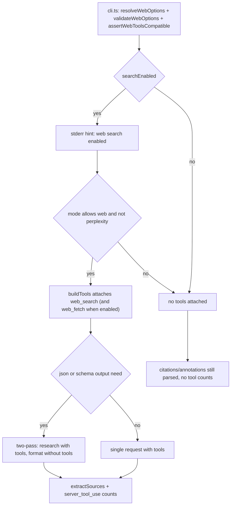

# Web search & OpenRouter server tools

grok-cli grounds single-call Grok modes (`auto`, `fast`, `expert`) and `retrieve` through **OpenRouter server tools** — `openrouter:web_search` and the opt-in `openrouter:web_fetch` — which OpenRouter executes server-side inside one `chat/completions` HTTP request. There is **no client-side tool loop**: the client attaches a `tools` array and OpenRouter runs zero or more searches/fetches, returning the final assistant message plus `message.annotations` (`url_citation`) and `usage.server_tool_use` counts. Perplexity Sonar models never receive these tools; `deepresearch` and `multi` never enable them (mode policy, see [modes-and-routing](/openwiki/concepts/modes-and-routing.md)).

Two modules own the mechanism: `src/config.ts` decides **whether** web tools may attach and with which options (`resolveWebOptions`, `validateWebOptions`, `assertWebToolsCompatible`), and `src/openrouter.ts` decides **how** they are serialized into a request (`buildTools`) and how the response's sources and tool usage are read back (`extractSources`, `mapServerToolUse`). `src/cli.ts` wires the two: it resolves and validates before `runMode`, prints the stderr hint, and runs the compatibility gate.

## Responsibility split

| Responsibility | Where |
|---|---|
| Per-mode web gate (`modeAllowsWeb`: `auto`/`fast`/`expert`/`retrieve` only), per-run option resolution, flag/config merge, conflict validation, model-capability guard | `resolveWebOptions`, `validateWebOptions`, `assertWebToolsCompatible`, `modeAllowsWeb`, `modelSupportsServerTools` in `src/config.ts` |
| Defaults for engine, result caps, fetch limits | `DEFAULT_WEB_CONFIG` in `src/defaults.ts` |
| Tool serialization: `openrouter:web_search` / `openrouter:web_fetch` parameter objects (or `undefined` for disabled/Perplexity) | `buildTools` in `src/openrouter.ts` |
| Retrospective accounting: search/fetch request counts from `usage.server_tool_use`, sources from `citations` + `url_citation` annotations | `mapServerToolUse`, `extractSources`, `handleSuccess` in `src/openrouter.ts` |
| Surveillance: stderr hint, web state on the result, footer/`--json` counts | `src/cli.ts` (`hint:` line), `PipelineResult.web`, `footer`/`formatJson` in `src/formatters.ts` |
| The two-pass JSON invariant (never combine `json_object` with tools) | `openrouter.ts` client gate + `runMode` two-pass branches in `src/modes.ts` (full detail on [pipeline](/openwiki/architecture/pipeline.md)) |

## Configuration surface and precedence

Config lives in `~/.config/grok-cli/config.json` under `web`, merged over `DEFAULT_WEB_CONFIG` (`src/defaults.ts#L20-L32`):

```json
{
  "web": {
    "search": {
      "enabled": true,
      "engine": "auto",
      "maxResults": 5,
      "maxTotalResults": 10
    },
    "fetch": {
      "enabled": false,
      "engine": "auto",
      "maxContentTokens": 50000
    }
  }
}
```

CLI web flags (`src/args.ts#L240-L278`) override the config values per run: `--no-web`, the deprecated `--web` (recorded as `deprecatedWebFlag`), `--web-fetch`, `--web-engine`, `--web-max-results`, `--web-max-total-results`, `--web-allowed-domains`, `--web-blocked-domains`, and `--web-fetch-engine`/`--web-fetch-max-content-tokens` (the last two parsed through the same `--web-*` family). `parseArgs` fills `CliWebOverrides` (empty flags default to `false`), `resolveCliOptions` merges config defaults for mode/profile, and `--web-provider` currently accepts only `"openrouter"` (the `WebProvider` type is the declared extension point for future providers).

## `resolveWebOptions` — the web gateway

`resolveWebOptions(config, mode, web)` (`src/config.ts#L97-L119`) produces one `ResolvedWebOptions` per run; everything the client attaches derives from it:

```text
searchEnabled =
  modeAllowsWeb(mode)                       # auto | fast | expert | retrieve only
  && (mode === "retrieve" ? true : config.web.search.enabled)   # retrieve forces search on
  && !web.noWeb                             # CLI --no-web wins over config
fetchEnabled = searchEnabled && (config.web.fetch.enabled || web.fetchFlag)
```

Key consequences (pinned in `test/config.test.ts#L58-L90` and `test/modes.test.ts#L56-L74`):

- **Search is on by default** for `auto`/`fast`/`expert` (`config.web.search.enabled: true`) and **forced on for `retrieve`** even when config disables it — the CLI's only escape hatch is `--no-web`.
- **Fetch is never forced** — `fetchEnabled` requires search enabled plus `config.web.fetch.enabled` or `--web-fetch`, because `raw_content` extraction from `web_fetch` is not wired into `SearchResult` yet; forcing it would add cost for no benefit (comment at `src/config.ts#L98-L101`).
- **`deepresearch` / `multi` always resolve to search disabled** — the `modeAllowsWeb` term short-circuits before config or flags are consulted, so `--web-fetch`, `--web-engine`, and domain flags are inert on those modes.
- Remaining fields fall back from CLI to config: `engine`, `maxResults`, `maxTotalResults`, `fetchEngine`, `maxContentTokens`, and optional `allowedDomains` / `blockedDomains` (omitted from the object when unset).

`validateWebOptions(web, cli)` (`src/config.ts#L69-L78`) rejects two conflicts before the run:

1. **Both** `allowedDomains` and `blockedDomains` set → `Cannot combine --web-allowed-domains and --web-blocked-domains for web search. Use one list only.`
2. `--web-fetch` with search disabled (e.g. with `--no-web`) → `Flag "--web-fetch" has no effect without web search. Drop --no-web or enable web.search in config.`

`assertWebToolsCompatible(config, profile, mode, web)` (`src/config.ts#L80-L95`) runs next in `cli.ts`: when web is enabled on a web-capable mode it resolves the mode's web model (`resolveWebModel`: `auto` → the `expert` alias, `fast` → the `fast` alias) and calls `modelSupportsServerTools` — `!model.startsWith("perplexity/")`. A Perplexity override on a web mode throws `Model <model> does not support OpenRouter server tools. Use a Grok model alias or run with --no-web.` The client enforces the same rule mechanically (`buildTools` returns `undefined` for `perplexity/`), and a 404/tool-use error from OpenRouter maps to a Grok-4.x-or-`--no-web` message (`src/openrouter.ts#L241-L258`).

## `buildTools` — parameter mapping per tool

`buildTools(model, web)` (`src/openrouter.ts#L37-L66`) returns `undefined` when web is fully disabled, when both search and fetch are off, or when the model is `perplexity/*`; otherwise it returns one or two tool objects:

| Tool | Parameters | Notes |
|---|---|---|
| `openrouter:web_search` | `max_results` (default 5), `max_total_results` (default 10), `allowed_domains`, **`excluded_domains`** | `engine` is included **only when not `"auto"`** (`--web-engine exa` sends `engine: "exa"`; the default omits it and lets OpenRouter pick). |
| `openrouter:web_fetch` | `max_content_tokens` (default 50000), `allowed_domains`, **`blocked_domains`** | `engine` included only when `fetchEngine` is not `"auto"`. |

The domain-list key difference is easy to trip over and is pinned by tests (`test/openrouter.test.ts#L34-L58`): `blockedDomains` maps to **`excluded_domains`** on `web_search` but stays **`blocked_domains`** on `web_fetch` — the two OpenRouter tools use different parameter names for the same user intent. `allowedDomains` is `allowed_domains` on both.

`:auto` engine handling matters operationally: `--web-engine exa` is the documented way to get a **fixed** engine instead of OpenRouter's `auto` selection, and engines such as Exa or Parallel may bill separately from the chat model (README cost notes and `HELP_TEXT`).

## In-flight behavior: one request, server-side execution

`callOpenRouter` builds the body (`model`, `messages`, optional `temperature`/`max_tokens`, `tools`, and optionally `response_format`), then POSTs to `https://openrouter.ai/api/v1/chat/completions` (`src/openrouter.ts#L93-L122`). With tools attached, OpenRouter runs the searches/fetches and returns the final assistant message in the same response — the spike confirmed a single HTTP round trip (~0.9–1.0s) with `usage.server_tool_use.web_search_requests` reporting how many searches the model actually ran. 429/5xx and network `TypeError` are retried up to 3 attempts with exponential backoff honoring a `Retry-After` header (see [openrouter-client](/openwiki/architecture/openrouter-client.md)).

Retrospective accounting flows from the response back into usage and output:

- `mapServerToolUse` (`src/openrouter.ts#L230-L239`) maps `usage.server_tool_use.web_search_requests` / `web_fetch_requests` into `ServerToolUse`, keeping only counts present **and greater than 0**.
- `extractSources` (`src/openrouter.ts#L68-L82`) merges top-level `citations[]` (plain URL strings) with `choices[0].message.annotations` of type `url_citation` (`{ url, title? }`), deduped by URL with titles folded in. Retrieve-mode `search_results` scores are then derived heuristically from citation order in `src/retrieval.ts` (`mergeRetrieveResults`).
- `handleSuccess` stamps each per-call result with `web: { searchEnabled, fetchEnabled }` from `call.web`; the pipeline normalizers later overwrite `mode`/`profile`/`outputFormat` and re-derive `web` from the canonical mode.
- `src/formatters.ts` surfaces the counts in the footer (`| Web searches: N`, `| Web fetches: N`, only when > 0) and in the `--json` payload under `usage.server_tool_use` and per-call `calls[].server_tool_use`; `usage.costUsd` aggregates per [cost.ts](/openwiki/architecture/openrouter-client.md) rules.

## Cost and token overhead — what `--no-web` saves

The Phase 0 spike (`docs/plans/2026-05-19-web-search-spike-results.md`) and README "Web search cost notes" pin the economics:

- **Attaching the tools costs prompt tokens even with zero searches**: measured ~1.8k prompt tokens and ~4× cost vs a ~143-token/`$0.0002` no-tools baseline on a "don't search" prompt (tools, 0 searches: ~1,782 prompt tokens, ~$0.0008).
- **When the model searches, prompt tokens and cost rise sharply** — search context is injected into the conversation: tools + 5 searches measured ~16.5k prompt tokens / ~$0.04 on the Node LTS spike prompt.
- **Search engines may bill separately**: Exa or Parallel pricing is separate from the chat model — check OpenRouter server-tools pricing; use `--web-engine exa` for a fixed engine instead of `auto`.
- Operational consequences: the stderr hint (`hint: OpenRouter web search is enabled (--no-web to disable)`) prints whenever search is on; the footer shows `Web searches: N` only when counts are present; agents are told to prefer `--no-web` for static/cheap prompts, and **`--web` is a deprecated no-op** (warning: `Flag "--web" is deprecated; web search is on by default. Use --no-web to disable.`).

`--max-cost` interacts with web runs because searches inflate per-call cost unpredictably; `withBudget` in `runMode` enforces the cap pre/post every call (see [pipeline](/openwiki/architecture/pipeline.md)).

## The `json_object` + tools incompatibility

`response_format { type: "json_object" }` must **never** be combined with server tools in one request. `callOpenRouter` enforces the rule mechanically (`src/openrouter.ts#L100-L108`):

```ts
if (call.json === true && supportsJsonObjectResponseFormat(call.model) && !tools) {
  body.response_format = { type: "json_object" };
}
if (tools) body.tools = tools;
```

The rationale is an observed failure: on Grok + `web_search`, constrained JSON often collapses to garbage like a bare `-1.5e-05` after large tool context is injected (comment at `src/openrouter.ts#L100-L104`; the `-1.5e-05` failure mode is also referenced in `parseDecisionAnswer` warnings and the reliability docs). Perplexity models are gated out of `response_format` by the same check.

When `--json` (or `--schema`) and web are both on, the pipeline resolves the conflict with **two passes** in `src/modes.ts` (see [pipeline](/openwiki/architecture/pipeline.md#two-pass-invariant-for---json--web-and---schema--web)):

1. **Research pass** — web tools attached, `json: false` (`role: "expert"` or `"schema_research"`), temperature 0.2.
2. **Format pass** — no web tools, `json: true` (`role: "json_format"` or `"schema"`), temperature 0.1, messages from `buildJsonFromResearchMessages` / `buildSchemaFromResearchMessages`.

Usage and sources merge across the two calls, and `--json` adds the warning `Used two-pass --json + web (research then JSON format) to avoid json_object+tools failures.` With web off, `--json` is a single call with `json_object` (because no tools are attached).



Caption: from option resolution to request serialization — search gating, tool parameter mapping, and the two-pass split that keeps `json_object` away from server tools.

## Failure and lifecycle semantics

- **Hard failures (exit 1):** allow+block domain conflicts and `--web-fetch` without search (`validateWebOptions`); Perplexity model with web enabled (`assertWebToolsCompatible`); OpenRouter 404/tool-use responses while tools were requested map to `Model does not support OpenRouter server tools: <model>. Use a Grok 4.x model, or run with --no-web.`; missing API key fails before any request.
- **Warnings, run continues:** deprecated `--web` flag; `--retrieve`/`--output` ignored on non-web modes; two-pass note; a `json_object`+tools collapse that slips through (bare `-1.5e-05`) degrades to a parse warning with `answer` omitted rather than a thrown error.
- **Ordering invariant:** `cli.ts` resolves → validates → asserts compatibility → prints hint → only then calls `runMode`, so invalid web combinations fail before any billable model call.
- **State on the result:** `PipelineResult.web` is always `{ searchEnabled, fetchEnabled }` for web-capable modes (from the resolved options) and `{ false, false }` for non-web modes and the `--x-only`/`--bookmarks-only` short-circuits; normalizers re-derive it from the canonical mode rather than trusting the per-call value.

## Focused tests

- `test/config.test.ts` — defaults (`L16-L25`), `modeAllowsWeb` (`L52-L56`), `resolveWebOptions` retrieve-force + `--no-web` override + fetch opt-in (`L58-L90`), `validateWebOptions` conflicts (`L92-L112`), `assertWebToolsCompatible` Perplexity rejection (`L114-L134`).
- `test/openrouter.test.ts` — `buildTools` mapping incl. `excluded_domains` vs `blocked_domains`, Perplexity and disabled-web omission, `web_fetch` attachment (`L14-L72`); `response_format` omitted when tools attached and for Perplexity (`L199-L236`); `web_fetch_requests` usage mapping (`L389-L410`); tool-use 404 error mapping (`L368-L387`); `extractSources` merging (`L74-L98`).
- `test/modes.test.ts` — `modeAllowsWeb` single-call-Grok-only (`L46-L54`), per-mode web enable/disable and `--no-web` (`L56-L74`), two-pass `--json` + web asserting 2 calls (`role: "expert"` with web, then `role: "json_format"` json-only) plus the two-pass warning (`L114-L151`), single-pass `--json` without web (`L153-L177`).
- `test/prompts.test.ts` — web-search instruction presence in system prompts, retrieve JSON contract, schema embedding (`L10-L26`, `L60-L80`).
- `test/retrieval.test.ts` — `parseRetrieveContent` never throws, `mergeRetrieveResults` scoring and URL precedence (`L1-L86`).
