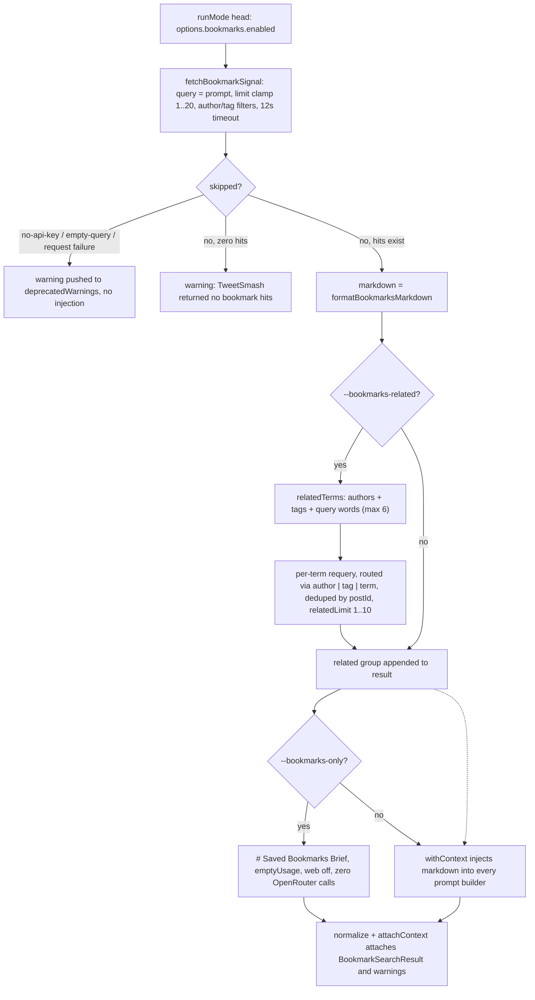

# TweetSmash bookmarks integration (--bookmarks)

TweetSmash is an optional live overlay on top of web research: it searches the **user's own saved X bookmarks** through the TweetSmash REST API and injects the hits into the research prompts. The implementation is deliberately native REST only — one HTTP call to `https://api.tweetsmash.com/v1/bookmarks` with keyword + semantic search — with no `ft`, no MCP, and no Python, so it works inside sandboxed "Amp orbs" as long as the API key environment variable is present (`src/bookmarks.ts#L1-L9`).

The module owns the whole feature end to end:

| Responsibility | Where |
|---|---|
| Resolve the API key from env (candidate order) | `tweetsmashApiKey` (`src/bookmarks.ts#L52-L58`) |
| Search the bookmarks library (keyword + semantic, optional author/tag filter) | `searchBookmarks` (`src/bookmarks.ts#L175-L233`) |
| Optional related pass re-querying authors/tags/terms from the first hits | `relatedTerms` + related loop (`src/bookmarks.ts#L103-L124`, `L200-L229`) |
| Map TweetSmash posts to `BookmarkHit` and derive post URLs | `mapPost` / `statusUrl` (`src/bookmarks.ts#L81-L101`) |
| Sign the result, avoiding thrown errors entirely | `fetchBookmarkSignal` (`src/bookmarks.ts#L267-L279`) |
| Render the `## Saved X bookmarks` / `## Related saves` markdown | `formatBookmarksMarkdown` (`src/bookmarks.ts#L235-L265`) |
| CLI flags, orchestration, injection, short-circuits | `src/args.ts#L312-L345`, `src/modes.ts#L108-L142`, `withContext` (`src/prompts.ts#L88-L106`) |
| JSON payload and result model | `src/formatters.ts#L78-L86`, `src/types.ts#L95-L142` |

## CLI surface

Every `--bookmarks*` flag both enables the feature and is self-contained: flags can be combined in any order and the prompt is the remaining positional text (`test/args.test.ts#L174-L188`).

| Flag | Effect |
|---|---|
| `--bookmarks` | Enable the overlay; searches once with the prompt as query |
| `--bookmarks-only` | Short-circuit: return the bookmark brief instead of running any model call |
| `--bookmarks-related` | Also requery related authors/tags/terms derived from the first hits |
| `--bookmarks-limit <n>` | Hits per request (default 8, hard-clamped 1..20) |
| `--bookmarks-author <user>` | Filter by author handle (leading `@` stripped) |
| `--bookmarks-tag <label>` | Filter by TweetSmash label/tag |

Parsing rules (`src/args.ts#L312-L345`): `--bookmarks-author` strips a leading `@`; `--bookmarks-limit` requires a positive integer (shared `parsePositiveInt`); each flag sets `enabled = true` on the parsed `CliBookmarkOptions` (`emptyBookmarkOptions`, `src/args.ts#L429-L431`).

## API key resolution

`tweetsmashApiKey(env)` scans exactly four environment variable candidates in order and returns the first non-empty (trimmed) value (`src/bookmarks.ts#L52-L58`):

1. `TWEETSMASH_API_KEY`
2. `TWEETSMASH_KEY`
3. `TWEETSMASH`
4. `TWEETSMASH_TOKEN`

```ts
const ENV_KEY_CANDIDATES = ["TWEETSMASH_API_KEY", "TWEETSMASH_KEY", "TWEETSMASH", "TWEETSMASH_TOKEN"] as const;
```

The order is asserted by `test/bookmarks.test.ts#L26-L32`: `TWEETSMASH_API_KEY` beats all fallbacks, `TWEETSMASH_TOKEN` alone works, and an empty env yields `undefined`. Only the primary name is mentioned in warnings and README, so agents should set the canonical `TWEETSMASH_API_KEY`.

## Search semantics

`searchBookmarks` clamps and validates before any network I/O (`src/bookmarks.ts#L175-L196`):

- `limit` — clamped to `1..20`, default **8**. `relatedLimit` — clamped to `1..10`, default **3**.
- `timeoutMs` — default `12_000` (12 s).
- `apiKey` — explicit option wins; otherwise env lookup; an empty/whitespace key is treated as missing.
- Empty query → skipped result.
- `author` / `tag` filters are appended as query params when provided (`author` with a leading `@` stripped).

Two params are always sent: `q` (keyword) and `vector_search_term` (semantic), both set to the trimmed prompt, so every request is a hybrid keyword+semantic search (`src/bookmarks.ts#L188-L194`). The request:

- **Endpoint:** `GET https://api.tweetsmash.com/v1/bookmarks` (`BASE_URL` is `https://api.tweetsmash.com/v1`).
- **Auth:** `Authorization: Bearer <apiKey>`; `Accept`/`Content-Type: application/json`; `User-Agent: grok-cli/0.1 (+https://github.com/manikanda-kumar/grok-cli)`.
- **Timeout:** `AbortController` aborted after `timeoutMs`, always cleared in `finally` (`src/bookmarks.ts#L130-L173`).

### Error mapping

`requestBookmarks` maps failures to typed `BookmarkSearchError` messages used verbatim as skip reasons (`src/bookmarks.ts#L151-L169`):

| Condition | Surface |
|---|---|
| HTTP 429 | `TweetSmash rate limited (100 req/hour).` |
| HTTP 401 / 403 | `TweetSmash unauthorized. Check TWEETSMASH_API_KEY.` |
| Any other non-2xx | `TweetSmash HTTP <status>` plus a 200-character body preview |
| Payload without `status: true` / `data[]` | server `message` or `TweetSmash returned an unexpected payload.` |
| `AbortError` (timeout) | `TweetSmash request timed out after <timeoutMs>ms.` |
| Any other fetch failure | `TweetSmash network error: <message>` |

Note the JSON-parsing branch: a response whose `status` is falsy or whose `data` is not an array throws a `BookmarkSearchError` (carrying the server `message` when present) instead of silently returning an empty hit list.

## Hit mapping

`mapPost` (`src/bookmarks.ts#L88-L101`) converts a `TweetsmashPost` to the canonical `BookmarkHit`:

- `postId` — `post_id`, trimmed; a missing id drops the hit (`null`).
- `url` — the tweet's `link` when present, else a synthesized `https://x.com/<handle|i>/status/<post_id>` (`statusUrl`, `src/bookmarks.ts#L81-L86`).
- `text` — tweet text collapsed to single spaces and truncated at 400 chars, falling back to `(tweet <postId>)`.
- `author` — `author_username` or `author_details.username`; `authorName` — `author_details.name`; `postedAt` — `tweet_details.posted_at`; `tags` — the non-empty `tags[]` entries.

`BookmarkHit` / `BookmarkRelatedGroup` / `BookmarkSearchResult` / `BookmarkSearchOptions` / `CliBookmarkOptions` are all declared in `src/types.ts#L95-L142`.

## The related pass (--bookmarks-related)

The related pass runs only when `options.related` is true **and** the primary query returned at least one hit (`src/bookmarks.ts#L200-L230`).

1. **Term derivation** — `relatedTerms(query, hits)` collects, in order, up to 6 unique terms (`src/bookmarks.ts#L103-L124`):
   - every hit author (leading `@` stripped),
   - every hit tag,
   - up to 3 query words longer than 3 characters after splitting on `/`, `:`, and `,`.
   Terms equal to the query itself (case-insensitive) and `@`-stripped duplicates are skipped.
2. **Routing** — each term is classified against the first hits: if the term matches a hit author → **author** (`author=` param); else if it matches a hit tag → **tag** (`tag=` param); else it is a **term** (`q=` + `vector_search_term=`). The `via` label is recorded per group (`src/bookmarks.ts#L205-L217`).
3. **Re-query** — each term is searched with `limit = relatedLimit`; hits already seen (by `postId`, seeded from the primary hits) are dropped, and author-routed groups additionally reject posts whose author differs from the term. Resulting hits are appended to that term's group (`src/bookmarks.ts#L219-L229`).

The test pins the key behavior: author-routed related queries send `author=matteocollina`, not `q=`, and the group carries the new post (`test/bookmarks.test.ts#L73-L94`).

## Skip reasons and failure semantics

`fetchBookmarkSignal` wraps `searchBookmarks` in try/catch and converts **any** outcome into a non-throwing `BookmarkSearchResult` (`src/bookmarks.ts#L267-L279`). Three `skipped: true` reasons surface:

| Reason | Produced by |
|---|---|
| `empty-query` | `searchBookmarks` returns `skipped("empty-query")` before any lookup (`src/bookmarks.ts#L176-L177`) |
| `no-api-key` | no env candidate resolved (`src/bookmarks.ts#L180-L181`) |
| request failure | `fetchBookmarkSignal` catches a `BookmarkSearchError` (rate limit, unauthorized, timeout, network, bad payload) and stores `error.message` as `reason` (`src/bookmarks.ts#L267-L279`) |

In `runMode` (`src/modes.ts#L108-L127`) skipped searches and zero-hit searches degrade to warnings, never hard failures: `no-api-key` becomes `TweetSmash token missing; --bookmarks skipped. Set TWEETSMASH_API_KEY.`, other reasons become `TweetSmash bookmark search skipped: <reason>.`, and a successful empty search becomes `TweetSmash returned no bookmark hits for this prompt.` — matching the pipeline's "partial failure" contract.

## Markdown formatting

`formatBookmarksMarkdown` (`src/bookmarks.ts#L235-L265`) renders:

- Skipped results: `TweetSmash token missing. Set TWEETSMASH_API_KEY (or TWEETSMASH_KEY / TWEETSMASH / TWEETSMASH_TOKEN).` for `no-api-key`, else `TweetSmash search skipped (<reason>).`
- Main section — heading `## Saved X bookmarks · <query>`; each hit as `- @handle — text` followed by an indented URL line plus ` · tags: a, b` when tags exist; empty hits print `No keyword/semantic hits in the TweetSmash library.`
- Related section — only groups **with hits** appear, under `## Related saves`, each as `### <via> \`<term>\`` with indented `- @handle — text` / URL lines.

The output and its `write_mode`/heading shape are pinned by `test/bookmarks.test.ts#L97-L123`. Rendering the markdown is a pure function of the result, so it runs once in `runMode` and the string is reused for both injection and the `--bookmarks-only` brief.

## Injection into prompts

`runMode` renders the markdown once (`bookmarksMarkdown`) and passes it through every prompt builder whenever a search succeeded (`src/modes.ts#L141-L142`) — `buildSingleCallMessages`, `buildResearchMessages`, `buildSynthesisMessages`, and the schema single/research passes all forward it into `withContext(prompt, xSignalMarkdown, bookmarksMarkdown)` (`src/prompts.ts#L88-L106`). The injected block is framed as prior personal context:

> ## User's saved X bookmarks (from TweetSmash REST)
> These are posts the user already bookmarked. Cite them as prior saves, not as live public opinion and not as official docs.
> When they are relevant, include a short ## Saved bookmarks section with @handle + URL. Do not invent bookmarks.

The system prompt additionally gains the `BOOKMARKS_INSTRUCTION` — treat saves as prior personal context, do not invent saves, include `## Saved bookmarks` when material — whenever `hasBookmarks` is true (`src/prompts.ts#L162-L163`, `L193-L195`). In the retrieve `--output both` synthesis the same block is appended to the sources block with the label `User saved bookmarks:` (`src/modes.ts#L431-L438`).

The search runs **before any model call** (it needs no model I/O) so the model never waits on it; a skipped or empty search simply injects nothing.

## Short-circuits: --bookmarks-only and the --x-only conflict

- **`--bookmarks-only`** — `runMode` returns `buildBookmarksOnlyResult` early (`src/modes.ts#L137-L139`, `L341-L370`): content is `# Saved Bookmarks Brief\n\n<formatBookmarksMarkdown>`, `sources` are derived from hits and related-group hits (`url` with `@author`/`postId` title), `usage` is `emptyUsage()`, and `web` is `{ searchEnabled: false, fetchEnabled: false }`. This is a **zero model call** result: no OpenRouter request, no budget consumption. It throws `--bookmarks-only requires a TweetSmash search result.` if the search was never attempted (`bookmarks` undefined).
- **Conflict** — combining `--x-only` with `--bookmarks-only` is a hard error thrown in `runMode`: `Cannot combine --x-only with --bookmarks-only.` (`src/modes.ts#L129-L131`).
- Both short-circuits skip normalization; their `warnings` are the deduped deprecation/feature warnings accumulated by the run head.

The full `PipelineResult.bookmarks` payload also travels into the JSON output via `formatJson` (`src/formatters.ts#L78-L86`) — `query`, `skipped`, `reason`, `hits`, `related` — and `attachBookmarks` folds deduped warnings into `result.warnings` (`src/modes.ts#L324-L331`).

## Lifecycle and invariants



Caption: `--bookmarks` lifecycle from flag to prompt injection, warning-on-skip degradation, and the `--bookmarks-only` zero-call short-circuit.

**Invariants worth keeping:**

- A bookmark run can never throw to the CLI: `fetchBookmarkSignal` converts every failure into a skipped result.
- `--bookmarks-only` and `--x-only` are mutually exclusive by construction (`runMode` throws before dispatch); each `--*only` requires its signal.
- The injected markdown is context only — it never replaces the web-research ground truth (X bookmarks are not docs or live public opinion).
- The related pass never grows the deduped primary hits: results are deduped across the whole run by `postId`, and author-routed groups enforce the author match.

## Focused tests

- `test/bookmarks.test.ts` — key resolution precedence (`L26-L32`), post mapping fields and `relatedTerms` derivation (`L34-L45`), skip-on-missing-key (`L47-L51`), keyword + `vector_search_term` params on the request URL (`L53-L71`), author routing of related queries (`L73-L94`), and markdown rendering (`L97-L123`).
- `test/args.test.ts#L174-L188` — flag parsing combinations for `--bookmarks`, `--bookmarks-only`, `--bookmarks-related`, `--bookmarks-limit`, `--bookmarks-author`, `--bookmarks-tag`.
- `test/prompts.test.ts#L36-L40` — bookmark injection into system + user messages.
- `test/modes.test.ts` — `runMode` fixture plumbing of `bookmarks: { enabled, only, related }` options (`test/modes.test.ts#L22`). The `--x-only`/`--bookmarks-only` conflict and short-circuit are enforced in `runMode` itself (`src/modes.ts#L129-L139`).
