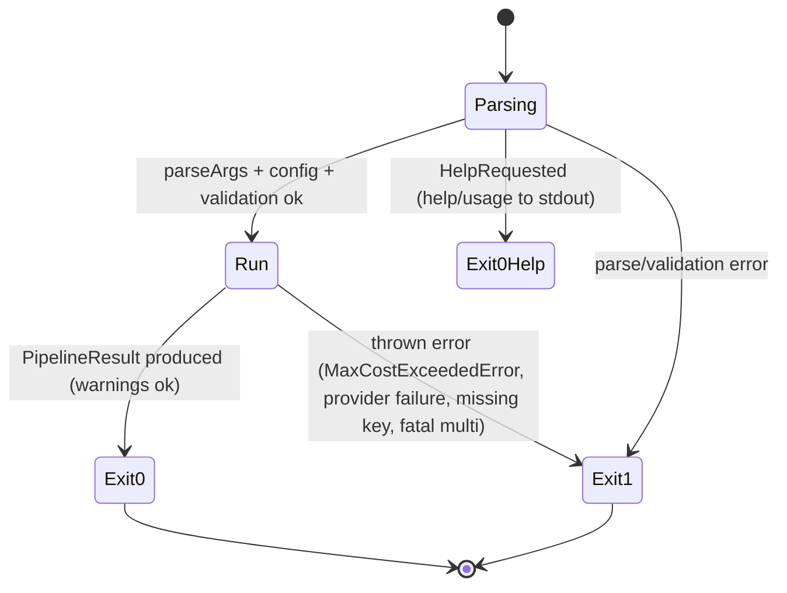

# Reliability, cost control & running the CLI

This page is the operations face of `grok-cli`: what the CLI does when the provider
misbehaves, how agent spend is capped, what appears on stderr versus stdout, what exit
codes mean, how to build/test the checkout, and how the wiki itself stays fresh. The
canonical design record for the retry, budget, and progress features is
[`docs/plans/2026-05-20-reliability-hardening.md`](repo://docs/plans/2026-05-20-reliability-hardening.md) —
this page summarizes behavior as implemented and tested.

## Retry, backoff & Retry-After

Every model call funnels through `callOpenRouter` in
[`src/openrouter.ts`](repo://src/openrouter.ts), and that one wrapper owns retries:
`src/cli.ts` wires it as the only `ModeCaller`, so a retryable failure in a single Grok
call, a two-pass stage, a `multi` leg, or a retrieve call behaves identically.

- **Attempts:** up to **3** (`attempt = 1..3`) against
  `https://openrouter.ai/api/v1/chat/completions` (`src/openrouter.ts#L111-L154`).
- **Retryable conditions:** HTTP `429`, any status `>= 500`, and network-level failures
  surfacing as `TypeError` whose message contains `fetch` (e.g. `fetch failed`)
  (`isRetryableError`, `src/openrouter.ts#L159-L161`). The final attempt throws the
  mapped error; a retryable condition that never succeeds throws `lastError`.
- **Backoff:** `2^attempt * 1000ms` (2s, 4s) via `retryDelay`
  (`src/openrouter.ts#L167-L176`). When the failed response carries a `Retry-After`
  header — typical for 429s — its value in seconds wins if larger:
  `Math.max(backoff, seconds * 1000)`. The header is read through optional chaining so
  mocked responses without `headers.get` do not crash the wait.
- **Never retried:** 401/403 auth, 402 credits/quota, 404 tool/model errors, and an
  unparseable JSON body on a 200 response (that one throws
  `OpenRouterError("OpenRouter returned an invalid JSON response. Please retry.", ...)`
  immediately — `src/openrouter.ts#L134-L139`).
- **Non-idempotent POST is deliberately replayed:** chat completions have no side
  effects, so retrying is safe.

<!-- openwiki: mermaid parse failed and this diagram was converted to a text fence so it does not break rendering. Fix the diagram source and restore the mermaid fence. Parser error: Heuristic: an unescaped angle bracket inside a label breaks rendering; rephrase the label. -->
```text
flowchart TD
    S["attempt = 1"] --> F["POST chat completions"]
    F --> OK{"response.ok"}
    OK -- no --> ERR["throw mapped OpenRouterError"]
    ERR --> R{"429 / >=500 and attempt lt 3"}
    R -- yes --> W["sleep retryDelay: 2^attempt*1000ms or Retry-After if larger"]
    W --> N["attempt + 1"]
    N --> F
    R -- no --> THROW["propagate mapped error"]
    OK -- yes --> J["response.json"]
    J --> JERR{"parse failed"}
    JERR -- yes --> INVALID["throw invalid-JSON OpenRouterError, no retry"]
    JERR -- no --> SUCCESS["normalize to PipelineResult via handleSuccess"]
    SUCCESS --> RET["return"]
```

Caption: `callOpenRouter` retry flow — 3 attempts, retry only on 429/5xx/fetch TypeError, `Retry-After` overriding the exponential backoff when larger.

Known gap recorded in the plan: backoff has **no jitter**, so many parallel CLI
instances share a thundering-herd risk under a shared rate limit; `Retry-After`
mitigation only applies when the server sends the header
(`docs/plans/2026-05-20-reliability-hardening.md#L56-L57`).

## Cost control: `--max-cost` and the unknown-cost warning

`--max-cost <n>` caps total spend at `<n>` USD. It is parsed in
[`src/args.ts`](repo://src/args.ts) (finite, `> 0`, else
`Invalid value for --max-cost` — `src/args.ts#L379-L385`) and enforced *preventively*
by `withBudget` in [`src/modes.ts`](repo://src/modes.ts), which wraps the caller before
any dispatch (`src/modes.ts#L53-L66`):

- **Pre-check:** before each call, if cumulative spend already exceeds the cap, throw
  `MaxCostExceededError` without firing the call.
- **Post-check:** after each call, add its `usage.costUsd` to the running total; throw
  immediately if the cap is now crossed. The error pins the abort point:
  `Cost $<spent> exceeded limit of $<limit> (aborted after "<role>")`
  (`MaxCostExceededError`, `src/modes.ts#L43-L48`).
- **Worst-case billing:** a call's cost is only known *after* it completes, so the leg
  that detects the overrun is always billed — the wrapper cannot know a call's cost
  without making it. Everything after that leg is never dispatched.
- **`multi` under budget:** analysis legs switch from parallel (`Promise.allSettled`)
  to sequential (`runSequential`, `src/modes.ts#L70-L84`) when `--max-cost` is set, so
  the pre-check stops dispatching fresh billable legs the instant the cap is crossed
  (`src/modes.ts#L579-L588`). A budget abort in any leg is **fatal**: it is rethrown,
  not demoted to a warning, and synthesis is skipped.
- **Degradation:** if any call reports no cost (`usage.costUsd === undefined`), the
  wrapper stops enforcing (`costKnown = false`). After a completed run with
  `--max-cost` set, `cli.ts` prints the always-on stderr warning
  `warning: --max-cost set ($X) but OpenRouter returned no cost; limit not enforced`
  so a silently-unenforced cap stays visible (`src/cli.ts#L36-L40`).

The aggregate-cost invariant that makes this work lives in `src/cost.ts`:
`usage.costUsd` is present **only when every call so far reported a cost**
(`addUsageCall`, `src/cost.ts#L11-L27`); `mergeUsage` replays calls through the same
rule, and `formatCost` renders `"unavailable"` otherwise. `--max-cost` is most
recommended for the expensive pipelines — `multi` (5 calls) and `--output both` /
`--json` + web (2 calls) — per the `HELP_TEXT` agent tips
(`src/args.ts#L170-L179`).

## stderr output contract

The split is strict: **stdout carries only the result; every diagnostic goes to
stderr** (`src/cli.ts#L30-L67`). The stderr channels, in order of appearance:

| Channel | Text / rule | Gating |
|---|---|---|
| **Hint** | `hint: OpenRouter web search is enabled (--no-web to disable)` | printed by `cli.ts` whenever `web.searchEnabled` is true (`src/cli.ts#L30-L32`) |
| **Progress** | `Step 1/1: ...`, `Step 1/2: Researching with web search...`, `Step 2/2: ...`, `Step 1/3..3/3`, `Bookmarks: searching TweetSmash library...`, `X signal: invoking Grok agent (...) for /whathappened...` | gated on `!options.json` in `src/modes.ts` (and `jsonQuiet` in `src/x-signal.ts`); the two-pass `--json` + web step lines and the `--x` spawn line are the notable exceptions (`src/modes.ts#L246`, `L261`) |
| **Warnings** | `warning: <msg>` lines — deprecated `--web` flag, deprecated `research` mode, ignored `--retrieve`/`--output` on non-web modes, unknown-cost under `--max-cost` | deprecated/ignored-flag warnings print only in non-JSON `--raw` runs (`src/cli.ts#L42-L46`); the unknown-cost warning is always on |
| **Errors** | `formatError`: `Error: <message>` in text mode, `{"error":{"message":"..."}}` (2-space pretty) when `--json` was requested | always; JSON shape decided by `wantsJson` pre-scan of raw argv so parse-stage errors are still JSON (`src/args.ts#L417-L419`, `src/formatters.ts#L91-L95`) |

`--json` keeps stderr clean of progress, and warnings ride inside the JSON
`warnings` array instead of stderr lines. Non-JSON runs surface the warning list in
the `## Warnings` markdown section of the output too (`src/formatters.ts#L128-L131`).

## Exit-code contract

- **0** — any run that produced a `PipelineResult`, including runs with warnings,
  deprecated flags, skipped bookmarks, or a `parseDecisionAnswer` failure that degraded
  to content-only. `-h`/`--help` also exits 0 after printing `HELP_TEXT` to stdout
  (`HelpRequested` caught in `src/cli.ts#L61-L64`).
- **1** — any thrown error, set via `process.exitCode = 1` in the catch block
  (`src/cli.ts#L60-L68`): missing prompt, unknown/conflicting flags, missing API key,
  web-option conflicts, tool-incompatible models, OpenRouter/provider failures,
  `MaxCostExceededError`, and `multi`'s fatal conditions. With `--json` on the command
  line the error prints as JSON on stderr; otherwise as `Error: <message>`.



Caption: exit-code state machine — 0 for any produced result or help, 1 via `process.exitCode` for every thrown error, with `--json` errors shaped as JSON on stderr.

## Dev workflow from package.json

`package.json` (`repo://package.json`) maps the `grok-research` bin to `dist/cli.js`
(ESM, Node >= 20) and defines the checkout commands:

| Command | Runs | Use |
|---|---|---|
| `pnpm dev` | `tsx src/cli.ts` | run the CLI from a checkout (same entrypoint as the built bin) |
| `pnpm grok-research` | `tsx src/cli.ts` | dev-checkout invocation matching the installed command name |
| `pnpm build` | `tsup src/cli.ts --format esm --clean --out-dir dist` | produce `dist/cli.js` for `npm link` / global use |
| `pnpm test` | `vitest run` | the Vitest suite (see [testing](/openwiki/testing/overview.md)) |
| `pnpm typecheck` | `tsc --noEmit` | strict typecheck (`exactOptionalPropertyTypes` matters: optional keys are omitted, never `undefined`) |

The reliability plan's verification recipe is `pnpm typecheck && pnpm test && pnpm
build` (`docs/plans/2026-05-20-reliability-hardening.md#L66-L72`). The `--json`
exit-code contract is pinned end-to-end by `test/cli.test.ts`, which spawns
`pnpm tsx src/cli.ts --json` with no prompt and asserts exit 1 plus the exact JSON
error on stderr (`repo://test/cli.test.ts`).

## Wiki snapshot (no scheduled OpenWiki workflow)

This repository does not ship `.github/workflows/openwiki-update.yml` or `AGENTS.md`.
The pages under `openwiki/` are an offline snapshot. Prefer updating source and
[`README.md`](repo://README.md); there is no scheduled job that regenerates the wiki.

## Focused tests that pin these contracts

- `test/openrouter.test.ts` — retry on `TypeError("fetch failed")` (`L280-L301`),
  429→500→success sequencing (`L412-L442`), fail-after-3 (`L444-L464`), `Retry-After`
  5s beating the 2s backoff with fake timers (`L321-L350`), invalid-JSON surfaced
  without retry (`L303-L319`), credential/credit/model error mapping (`L238-L278`).
- `test/modes.test.ts` — `--max-cost` abort on a single call that itself crosses the
  cap (`L257-L263`); capped `multi` runs sequentially and dispatches only
  `["research","engineering"]` before aborting (`L265-L276`).
- `test/args.test.ts` — `--max-cost` parsing incl. `invalid` and `-1` rejections
  (`L95-L98`).
- `test/cost.test.ts` — `costUsd` present only when every call reports a cost; the
  invariant `withBudget`'s `costKnown` flag relies on.
- `test/cli.test.ts` — real `spawnSync` of the CLI asserting the exit-code/JSON-error
  contract.
