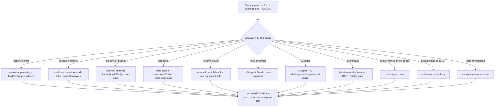

# Quickstart — navigating the grok-cli wiki

`grok-cli` is a zero-dependency TypeScript/Node CLI (Node ≥ 20, ESM) that turns one
prompt into a grounded, cited research result by calling OpenRouter chat completions —
xAI Grok models for reasoning and Perplexity Sonar for deep research. This page is the
**task-routing map**: find the page that owns the area you are about to change, read the
overview and the testing page before touching code, and keep the authored files that
this wiki regenerates from in sync. Full architectural detail lives on
[overview](/openwiki/architecture/overview.md).

## Read this first: how this wiki is maintained

- **This `openwiki/` tree is an offline snapshot**, copied from a deepseek-v4-flash
  `--init`. grok-cli has **no** `AGENTS.md` and **no**
  `.github/workflows/openwiki-update.yml`.
- **Authority ordering.** Source code and tests are authoritative;
  [`README.md`](repo://README.md) is the user-facing contract (flag table, mode table,
  model aliases, agent tips). A wiki uncertainty is a verification gap, not an automatic
  requirement.
- **Validation.** Prefer the narrowest test that pins the changed behavior and keep
  complete failure output — the Vitest suite embodies this (see
  [testing](/openwiki/testing/overview.md)).

## One run, end to end

```text
cli.ts main()
 1. parseArgs(argv)      → mode token only as the first non-flag arg; -- terminator;
                          -h/--help throws HelpRequested → HELP_TEXT on stdout, exit 0
 2. loadConfig()         → defaults ← ~/.config/grok-cli/config.json ← OPENROUTER_API_KEY env
 3. resolveCliOptions()  → fills mode/profile from config only when not explicit
 4. canonicalizeMode()   → deprecated "research" → "deepresearch" (+ warning)
 5. resolveWebOptions → validateWebOptions → assertWebToolsCompatible
 6. stderr hint: "hint: OpenRouter web search is enabled (--no-web to disable)"
 7. runMode(config, options, caller): withBudget wraps the caller; --x / --bookmarks
    signals gathered first (zero model calls); dispatch in strict priority order
    schema → multi → retrieve → deepresearch → single Grok call
 8. normalize (stamp mode/profile/outputFormat/web; parse answer/schemaResult/searchResults)
 9. one formatter → stdout; any thrown error → formatError on stderr, exit code 1
```

Every branch funnels through the single OpenRouter caller
`(call) => callOpenRouter(config.openrouter, call)` wired in `cli.ts`
([src/cli.ts](repo://src/cli.ts#L16-L68)), so retry, error mapping, source extraction,
and usage accounting behave identically across one-call, two-pass, five-call, and
short-circuit runs. The stdout/stderr contract is strict: **stdout carries only the
result; every diagnostic goes to stderr**; `--json` errors are JSON on stderr
(`{"error":{"message":"..."}}`), detected by the `wantsJson` argv pre-scan so even
parse-stage failures are JSON-shaped ([src/args.ts](repo://src/args.ts#L417-L419),
[test/cli.test.ts](repo://test/cli.test.ts#L1-L14)).

## The task → page map

| If you are changing or need... | Go to |
|---|---|
| A flag (new/existing), `src/args.ts` grammar, config file merge, precedence, model alias tables | [overview](/openwiki/architecture/overview.md) |
| Mode semantics, the mode→model→call-count→web decision matrix, `canonicalizeMode`, web compatibility | [modes-and-routing](/openwiki/concepts/modes-and-routing.md) |
| Pipeline behavior: `runMode` dispatch order, two-pass, `withBudget`, normalization | [pipeline](/openwiki/architecture/pipeline.md) |
| Web behavior: `resolveWebOptions`/`buildTools`, `excluded_domains` vs `blocked_domains`, cost overhead | [web-search](/openwiki/concepts/web-search.md) |
| `retrieve` / `--retrieve` / `--output results\|both`, `search_results[]`, scoring | [retrieval](/openwiki/workflows/retrieval.md) |
| `multi` ensemble: role legs, parallel vs sequential, synthesis, partial failure | [multi-agent](/openwiki/workflows/multi-agent.md) |
| `--x` / `--x-only` / `/whathappened` Grok-agent signal | [x-signal](/openwiki/integrations/x-signal.md) |
| `--bookmarks` TweetSmash REST overlay | [tweetsmash-bookmarks](/openwiki/integrations/tweetsmash-bookmarks.md) |
| Costs, retries, `--max-cost`, exit codes, stderr contract, dev commands, the OpenWiki workflow | [reliability-and-cost](/openwiki/operations/reliability-and-cost.md) |
| Output shape: `PipelineResult`, `--json` payload keys, brief/report/raw/retrieve renders | [output-and-formatting](/openwiki/architecture/output-and-formatting.md) |
| The provider client itself: request body, retries, sources, usage aggregation | [openrouter-client](/openwiki/architecture/openrouter-client.md) |
| Validating a change: per-module invariants, mock patterns | [testing](/openwiki/testing/overview.md) |
| The whole system: entrypoint lifecycle, module table, runtime domains | [overview](/openwiki/architecture/overview.md) |



Caption: routing every class of change to its wiki page; every path ends in "update the
README contract and validate with typecheck + tests".

## Where each module is documented

| Module | Responsibility | Primary page |
|---|---|---|
| `src/cli.ts` | Sole entrypoint: parse, resolve, dispatch, format, error → exit code | [overview](/openwiki/architecture/overview.md), [output-and-formatting](/openwiki/architecture/output-and-formatting.md), [reliability-and-cost](/openwiki/operations/reliability-and-cost.md) |
| `src/args.ts`, `src/config.ts`, `src/defaults.ts` | Flag parsing, config load/merge/precedence, mode canonicalization, web resolution/validation | [overview](/openwiki/architecture/overview.md), [modes-and-routing](/openwiki/concepts/modes-and-routing.md) |
| `src/modes.ts` | `runMode` pipeline orchestration, budget wrapper, multi fan-out, retrieve, normalization | [pipeline](/openwiki/architecture/pipeline.md) |
| `src/prompts.ts` | System/user message builders per output format, mode, and X/bookmark injection | [pipeline](/openwiki/architecture/pipeline.md), [x-signal](/openwiki/integrations/x-signal.md), [tweetsmash-bookmarks](/openwiki/integrations/tweetsmash-bookmarks.md) |
| `src/openrouter.ts`, `src/cost.ts` | The one OpenRouter chat-completions wrapper (tools, retries, sources) and usage/cost aggregation | [openrouter-client](/openwiki/architecture/openrouter-client.md), [web-search](/openwiki/concepts/web-search.md) |
| `src/types.ts`, `src/formatters.ts`, `src/retrieval.ts` | `PipelineResult` contract, stdout renders, retrieve JSON parsing/scoring | [output-and-formatting](/openwiki/architecture/output-and-formatting.md), [retrieval](/openwiki/workflows/retrieval.md) |
| `src/x-signal.ts` | Headless Grok agent spawn for `/whathappened`, marker parsing, nested guard | [x-signal](/openwiki/integrations/x-signal.md) |
| `src/bookmarks.ts` | TweetSmash REST bookmark search, related pass, skip semantics, markdown | [tweetsmash-bookmarks](/openwiki/integrations/tweetsmash-bookmarks.md) |
| `test/*.test.ts` | Vitest invariants per module and the single real `spawnSync` e2e | [testing](/openwiki/testing/overview.md) |

## Invariants to preserve (change these only deliberately)

- **`json_object` never combines with server tools.** `callOpenRouter` sets
  `response_format` only when `json && model supports it && !tools`
  ([src/openrouter.ts](repo://src/openrouter.ts#L100-L108)); `--json`/`--schema` + web
  resolve to a **two-pass** research(with tools)→format(without tools) pattern because a
  single constrained request on Grok + `web_search` collapses to garbage like a bare
  `-1.5e-05`.
- **`modeAllowsWeb` is true only for `auto`/`fast`/`expert`/`retrieve`.**
  `deepresearch`, `multi`, and deprecated `research` never attach OpenRouter web tools;
  `--retrieve`/`--output` on them degrade to a warning. Retrieve mode forces search on
  unless `--no-web`.
- **`costUsd` exists only when every call reported a cost** (`addUsageCall`/`mergeUsage`
  in `src/cost.ts`); `--max-cost` enforcement (`withBudget`) degrades to an always-on
  stderr warning when any call's cost is unknown.
- **Mode is the source of truth for the result header.** Every non-short-circuit branch
  ends in `normalizeResult`/`normalizeRetrieveResult`/`normalizeSchemaResult`, which
  overwrite the client's `"auto"`/`"quality"`/`"raw"` placeholders and re-derive `web`
  from the canonical mode.
- **Exit-code contract:** 0 for any produced `PipelineResult` (warnings and parse
  fallbacks included) or `-h`/`--help`; 1 via `process.exitCode` for every thrown error;
  `--json` shapes errors as JSON on stderr.
- **`--x-only` and `--bookmarks-only` are zero-model-call short-circuits** with
  `emptyUsage()` and web off, and combining them is an error.

## Changing something? Minimum checklist

1. Find the owning page from the map above and read its invariants and focused tests.
2. Update the source and the user-facing contract (`README.md` flag/mode/alias tables,
   agent tips) together — README is what agents read first.
3. Add or adjust the narrowest test that pins the changed behavior
   (see [testing](/openwiki/testing/overview.md) for the mock seams: `ModeCaller` fakes,
   `fetchImpl`, `spawnImpl`, one real `spawnSync` in `test/cli.test.ts`).
4. Run `pnpm typecheck && pnpm test && pnpm build` (`tsc --noEmit`, `vitest run`, `tsup
   src/cli.ts --format esm --out-dir dist`).
5. Keep `README.md` flag/mode/alias tables in sync. This repo has no scheduled
   OpenWiki workflow; treat `openwiki/` as a snapshot.
