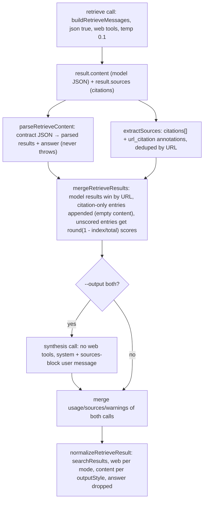

# Retrieval workflow (Tavily-style results)

The retrieval workflow is grok-cli's **raw web-retrieval path**: instead of a
synthesized decision brief, it returns a Tavily-shaped `search_results[]` array
— `{ title, url, content, score? }` — that coding agents can feed RAG pipelines
or inspect directly. It activates in three situations that collapse into the
same `runRetrieve` branch: `retrieve` mode (`grok-research retrieve --json "..."`),
`--retrieve` on any web-capable Grok mode (`grok-research expert --retrieve --json "..."`),
and `--output results` / `--output both` on a web-capable mode (`src/modes.ts#L207-L223`).
Choice guidance from the README: *"Use `retrieve` or `--retrieve` for Tavily-style
`results[]` — when you need raw retrieval (RAG input) not a synthesized brief."*

The workflow spans four modules plus one test file:

| Module | Responsibility |
|---|---|
| `src/prompts.ts` | `buildRetrieveMessages` — the retrieve JSON contract the model is told to emit |
| `src/modes.ts` | `runRetrieve` dispatch/merge, the optional synthesis pass, `normalizeRetrieveResult`, the ignored-retrieve warning |
| `src/retrieval.ts` | `parseRetrieveContent` (never-throws parser), `resultsFromSources`, `mergeRetrieveResults` (scoring + URL precedence) |
| `src/formatters.ts` | `formatRetrieveMarkdown` (non-JSON stdout) and `search_results` in the `--json` payload |
| `test/retrieval.test.ts` | focused tests pinning the parser, the scoring heuristics, and the URL-merge precedence |

## Activation, routing, and the non-web-mode warning

`runMode` computes `retrieveRequested = mode === "retrieve" || options.retrieve ||
options.outputStyle !== "brief"` and then gates on `modeAllowsWeb(mode)`
(`src/modes.ts#L207-L223`):

```text
retrieve mode                     → retrieve branch (web allowed)
--retrieve / --output results|both on auto|fast|expert → retrieve branch
--retrieve / --output results|both on deepresearch|multi → ignored + warning
```

- **Web-capable modes** (`auto`, `fast`, `expert`, `retrieve`) run `runRetrieve`.
  `resolveWebOptions` **forces search on for `retrieve` mode** even when config
  has `web.search.enabled: false`; `--no-web` is the only escape hatch. Fetch is
  never forced because `raw_content` extraction from `openrouter:web_fetch` is
  not yet wired into `SearchResult` (`src/config.ts#L97-L104`).
- **Non-web modes** (`deepresearch`, `multi`) push the warning
  `--retrieve/--output was ignored in <mode> mode; this mode does not use OpenRouter web tools.`
  and run their normal pipeline instead — no retrieve call ever fires
  (pinned in `test/modes.test.ts#L555-L581`). `modeAllowsWeb` returns true only
  for the four web-capable modes (`src/config.ts#L55-L57`).

Per-mode call counts: one `retrieve` call by default, **two** calls with
`--output both` (retrieve + synthesis, `mergeUsage` over both). Model resolution
uses the Grok `expert` alias, or the `fast` alias in `fast` mode
(`src/modes.ts#L409`).

## The retrieve JSON contract (`buildRetrieveMessages`)

The one retrieve call is `role: "retrieve"`, temperature **0.1**, `json: true`,
web tools attached (`src/modes.ts#L412-L419`). Its messages come from
`buildRetrieveMessages(prompt)` — a bare system prompt plus the raw user prompt,
no X/bookmark injection (`src/prompts.ts#L108-L113`). The system instruction
(`RETRIEVE_INSTRUCTION`, `src/prompts.ts#L6-L7`) defines the contract verbatim:

> You have live web search. Run searches to find the most relevant, authoritative
> results for the query. After searching, return ONLY a JSON object with this exact
> shape: `{ "results": [ { "title": string, "url": string, "content": string } ], "answer": string }`.
> The results array must contain one entry per distinct source you found, ranked
> by relevance, with a concise snippet (1-3 sentences) in content. The answer field
> must be a short (2-4 sentence) summary if the query asks for one, otherwise an
> empty string. Do not include any text outside the JSON. Do not wrap it in Markdown fences.

So the client sends `json: true` **plus** web tools, and the model is expected to
return the contract JSON as raw `content`. Note this is the one path that *does*
combine a JSON expectation with server tools (the model emits JSON via prompt
instruction rather than `response_format json_object`; the client's
`json_object`-plus-tools gate still applies, so `response_format` is not set —
see [openrouter-client](/openwiki/architecture/openrouter-client.md)).

## `parseRetrieveContent` — tolerant parsing, never throws

`parseRetrieveContent(content)` (`src/retrieval.ts#L16-L34`) turns the model's raw
JSON into `{ results, answer? }` and is deliberately failure-tolerant so the
pipeline can still surface sources and usage:

- Invalid JSON → `{ results: [] }`, no throw.
- Non-object payload, or `results` not an array → `{ results: [] }`.
- Per-entry coercion (`toSearchResult`, `src/retrieval.ts#L36-L49`): `url` must be
  a non-empty string or the entry is dropped; non-string `title`/`content`
  become `""`; `score` is kept only when a finite number; `raw_content` is
  preserved when a string. `answer` survives only when it is a string.
- Fenced JSON is **not** unwrapped here (unlike `parseDecisionAnswer`) — the
  contract tells the model not to fence, and a fenced payload would parse as
  invalid JSON and yield empty results.

`SearchResult` (`src/types.ts#L212-L219`) documents that `score` and `raw_content`
are populated only when the provider surfaces them; OpenRouter web tools expose
title/url/snippet via annotations, so scores are derived heuristically.

## Building `searchResults`: model results + citation sources, merged by URL

`runRetrieve` calls `mergeRetrieveResults(parseRetrieveContent(result.content), result.sources)`
(`src/modes.ts#L421-L422`). `result.sources` is the OpenRouter citation extraction
(`extractSources` in `src/openrouter.ts#L68-L82`: top-level `citations[]` plus
`url_citation` annotations, deduped by URL, titles merged in — re-exported from
`src/retrieval.ts`). The merge (`src/retrieval.ts#L69-L86`) has three rules:

1. **Model results win by URL** — every parsed result keeps its snippet; a
   citation whose URL already appears is skipped, so the model's (scored)
   content never gets overwritten by an empty annotation entry.
2. **Citation-only URLs are appended** with `content: ""` (title from the
   citation when present) so URLs that only appear as annotations are still
   represented.
3. **Unscored entries get heuristic scores** — after unioning, entries without a
   `score` receive `roundScore(1 - index / total)` in map order: earlier entries
   rank higher, all scores fall in (0, 1] (the first entry scores exactly 1 when
   all are unscored). `roundScore` rounds to 3 decimal places
   (`src/retrieval.ts#L88-L90`). Model-emitted scores are never recomputed.

The companion `resultsFromSources(sources)` (`src/retrieval.ts#L55-L64`)
implements the same citation-order heuristic standalone — it maps each source to
a result with empty content and `roundScore(1 - index / count)` — and is exported
for retrieval tests and callers that only have sources.



Caption: the retrieve workflow — one model call, then the parsing/scoring merge
into `searchResults`, an optional web-less synthesis call for `--output both`,
and normalizeRetrieveResult shaping the final result.

## `--output both`: the synthesis pass (web intentionally off)

With `outputStyle === "both"`, `runRetrieve` fires a **second** call after merge
(`src/modes.ts#L426-L451`):

- It renders the merged `searchResults` into a **retrieved sources block** — one
  `- title: url` bullet per result, snippet indented beneath when present — plus
  optional `Live X/Twitter sample:` / `User saved bookmarks:` blocks when `--x` /
  `--bookmarks` ran.
- The synthesis user message is `Query: <prompt>\n\nRetrieved sources: <block>\n\nSynthesize the answer.`
  (with the X/bookmark blocks and "include ## X signal / ## Saved bookmarks if
  relevant" framing when present).
- System prompt: *"Write a concise Markdown decision brief grounded in the
  provided sources. Cite URLs inline."*
- **Web is intentionally off** on this call (`web` omitted from the `ModeCall`):
  grounding is already in the retrieved sources block, and re-enabling web would
  add cost and latency for no new information. Temperature 0.2. The test asserts
  `caller.mock.calls[1]?.[0].web` is `undefined` (`test/modes.test.ts#L409-L427`).

The two results are merged (`content` from synthesis, `mergeUsage` over both,
sources and warnings concatenated, `src/modes.ts#L453-L461`) before
normalization. `--max-cost` therefore applies to 2 calls here; the HELP_TEXT
advises `--max-cost` specifically for `--output both` (`src/args.ts#L175`).

## `normalizeRetrieveResult` — per-output-style content and web stamping

`normalizeRetrieveResult` (`src/modes.ts#L466-L499`) stamps `mode` / `profile` /
`outputFormat`, dedupes warnings, attaches `searchResults`, drops the legacy
`answer` field (retrieve never carries a `DecisionAnswer`; the test asserts
`result.answer` stays `undefined`, `test/modes.test.ts#L429-L437`), and sets
`web` per mode — `{ searchEnabled, fetchEnabled }` for web-capable modes,
`{ false, false }` otherwise (re-derived from `modeAllowsWeb`, never trusted from
`call.web`).

Content semantics per output style, with the retrieve-mode default `"brief"`:

| `--output` | `content` | Call count |
|---|---|---|
| `brief` (default) | raw retrieve JSON as returned by the model | 1 |
| `results` | the optional LLM `answer` string when the model returned one, else `""` | 1 |
| `both` | the synthesis brief (already merged in) | 2 |

Pinned by `test/modes.test.ts#L399-L407` (results → content is `"sum"`) and the
merged result in the both test. Non-JSON stdout for `results` / retrieve mode is
`formatRetrieveMarkdown` (`src/formatters.ts#L14-L30`): content first, then a
`## Results` list with `**title** (score: N)` / URL / snippet per entry, then
warnings and the footer; the `--json` payload carries the same array as
`search_results` with `score` / `raw_content` / `favicon` only when present
(`src/formatters.ts#L63-L65`, `L97-L107`). X signal and bookmarks are still
attached to retrieve results through `attachContext`.

## Invariants and failure semantics

- **A malformed model payload degrades, never aborts.** Invalid JSON, a
  non-object, or a non-array `results` yields `{ results: [] }`; entries without
  a URL are dropped. The run still completes with usage, sources, and — when the
  parse left any — the optional answer.
- **Scores are either model-emitted or heuristic, never both.** Entries that
  carry a score keep it; everything else is scored by position after the URL
  union, `round((1 - index/count) * 1000) / 1000`, in (0, 1].
- **The retrieve branch never parses `DecisionAnswer`** and `normalizeRetrieveResult`
  drops it — `searchResults` is the retrieve mode's structured payload, `sources`
  the flat citation list (a retrieve run's `sources` also includes
  citation-derived entries whose URLs never appeared in the model JSON).
- **Retrieve on a non-web mode is a no-op with a warning**, not an error: the
  user still gets the deepresearch/multi result, and the flags are surfaced as
  ignored in `warnings`.
- **`--output both` doubles the run** (2 calls, merged usage) and the synthesis
  leg never attaches web tools; `--max-cost` guards both calls.

## Configuration and operations

Retrieve adds no dedicated config: it inherits the `web` block
(`~/.config/grok-cli/config.json` → `DEFAULT_WEB_CONFIG`) merged exactly like any
web-capable mode — `engine`, `maxResults` (5), `maxTotalResults` (10),
`allowedDomains` / `blockedDomains` (mapped to `excluded_domains` on
`web_search`), fetch opt-in via `--web-fetch` (off by default). Domain
allowlists work on retrieve exactly as on `auto`/`fast`/`expert`, e.g.
`grok-research retrieve --web-allowed-domains developer.mozilla.org "..."`.
The model is always a Grok alias, so `assertWebToolsCompatible` applies; a
Perplexity override on a web mode throws before the run. Search engine choice
(`--web-engine exa`) and separate engine billing apply unchanged.

## Focused tests

- `test/retrieval.test.ts#L6-L46` — `parseRetrieveContent`: valid payloads keep
  score and `raw_content`; invalid JSON and non-array `results` return
  `{ results: [] }`; entries missing a `url` are skipped.
- `test/retrieval.test.ts#L48-L64` — `resultsFromSources`: descending
  citation-order scores within (0, 1]; empty for no sources.
- `test/retrieval.test.ts#L66-L86` — `mergeRetrieveResults`: model results keep
  snippets, citation-only entries are appended; unscored entries all get scores.
- `test/modes.test.ts#L358-L438` — retrieve routing with web enabled,
  retrieve-forces-search, `--no-web` respected, `--output results` content,
  second synthesis call in `--output both` (no web on the synthesis leg), and no
  `DecisionAnswer` parsing.
- `test/modes.test.ts#L440-L462` — `--retrieve` and `--output results` activate
  the retrieve path on `expert`.
- `test/modes.test.ts#L555-L581` — `--retrieve` / `--output results` ignored on
  `deepresearch` with the warning.
- `test/formatters.test.ts#L127-L151` — `formatRetrieveMarkdown`: results list
  with scores; empty-content handling.
- `test/retrieval.test.ts#L88-L106` — `extractSources` re-export merges
  citations and `url_citation` annotations.
